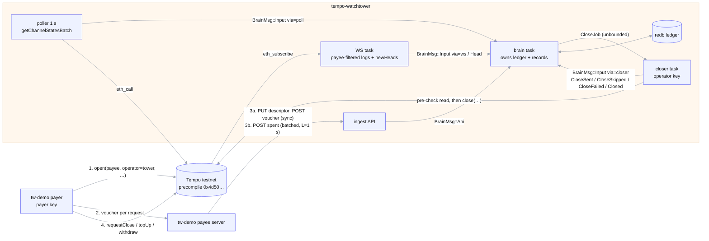

# tempo-watchtower: Setup & Build Guide

**Revision 4** (editorial restructure of the approved revision 3). **Deadline:** 2026-10-12
23:59 PT. **Day 1 = Tue 2026-09-29.**

**Outcome by Fri 10/9:** a public, CI-green Rust repo whose watchtower caught a real
`CloseRequested` on Tempo testnet and landed `close()` in seconds, with measured latency, next to a
control run that loses the payee's earnings. You write the core logic yourself and disclose the
rest honestly.

**Legend**
- **VERIFIED / UNVERIFIED**: checked (source read, RPC call, or code compiled and run on
  2026-09-28/29) vs not checked (each UNVERIFIED item has a fallback in §9).
- **[ran on testnet]** ran against Moderato. **[compiled]** is part of
  `reference/workspace-skeleton/`, which passes the exact CI commands (§5.1) plus
  `cargo deny check` and `cargo +1.95.0 check`. **[sketch]** is shape only.
- **GIVEN**: plumbing you copy, **one file or snippet per commit**, commit suffix
  `(plumbing from AI-drafted build guide)`, listed in your README disclosure (Appendix A).
- **EXERCISE**: you write it; the spec (tests) is given, the solution isn't in this guide.
- **SPOILER**: reference solutions exist only in `reference/workspace-skeleton/` (marked in
  `reference/README.md`). If you open one before your code passes, disclose it.

## Changes in revision 4 (editorial only)
- **Technical content unchanged** from the approved revision 3 (`tech-lead-review-round-3.md`):
  Tempo facts, addresses, ABI, capture/deadline rules, state-machine spec, test lists, CI YAML,
  security/key rules, disclosure rules, fallbacks and checkpoints are copied verbatim.
  `reference/` is untouched.
- **Removed:** the Rust learning path (book-chapter pointers, exercise-course references,
  per-milestone learning-outcome blocks, beginner explanations, reading assignments) and the
  top-of-file "four answers" table (a duplicate of §3.5–§3.8). One cheat-sheet table remains
  (§1.12).
- **Restructured:** §1 is a copy-paste setup (= M0) with a check after each step; M1–M10 are
  recipes (Goal → Steps → GIVEN → Spec → Verify → DoD → Commits) with collapsed hints; the
  per-round change tables moved to Appendix C.
- **Re-dated** from Tue 9/29 = day 1; same order, MVD and checkpoints; freed time = slack.
- **Setup re-verified** 2026-09-29 in a scratch repo (§1.4 copy loop, fmt/clippy/test 0, keygen,
  faucet balances `0xe8d4a51000`, `connected grace=900`).

---

**Research answers Q1–Q4** (sending txs, funds, operator support, event delivery): all
VERIFIED; see §3.5–§3.8.

## Contents
0. Plan: rules, schedule (from 9/29), MVD, **commit plan (§0.4)**
1. Setup (= M0, day 1): toolchain → repo → workspace → keys → funds → CI → first testnet run
2. Architecture and repo layout
3. Tempo integration details (verified)
4. Build recipes M1–M10, stretch S1–S5
5. CI/CD (copy-paste YAML)
6. Rules for a public open-source repo
7. Engineering practices for this daemon
8. Demo recording plan
9. Risks, unknowns and fallbacks
10. Using AI assistants
- Appendix A: README disclosure template · B: sources · C: review history

---

## 0. Plan

### 0.1 Working rules
- **One milestone per day; every day ends with something that runs on the real chain.** Testnet
  on day 1, the first automatic save on day 4; every later day adds one layer to something that
  already works.
- **Exercises come as specs:** copy the given test file → `cargo test` (red) → make it green.
  Open the collapsed hints only after 30+ minutes stuck.
- **Rule for stubs: a stub that code can reach before its exercise day returns a safe default,
  never `todo!()`.** Example: `classify_revert` returns `Transient` until M7. The only `todo!()`
  stubs in this plan (`plan_close`, `step`, `verify_voucher`) are called by nothing until you
  implement them on day 3. If you adapt the plan, keep it that way.
- **Commit at least 3 times a day, straight to `main`, and push daily.** Colosseum checks whether
  you "did significant work during the hackathon". Many small commits on `main` are that proof.
  GIVEN snippets get their own commits with the suffix `(plumbing from AI-drafted build guide)`.
- `docs/devlog.md`: 3–5 lines a day (what worked, what broke, tx links). It becomes your weekly
  update videos and interview answers.
- About **30 minutes a day for payee outreach** (item 2 on the project README's to-do list).
  Judges weigh it as heavily as the demo.

### 0.2 Schedule (Tue 9/29 → Mon 10/12)
**Assumption:** about 8 h/day are available; with no learning time, each build day is about
5–6 h of work, so roughly 2 h/day is slack. Starting a day later than revision 3 means one fewer
video day: the pitch and the portal share Sun 10/11, and Mon 10/12 stays a buffer.

| Date | Day | Milestone | Build h | End-of-day proof (commit it) |
|---|---|---|---|---|
| Tue 9/29 | 1 | **M0 = §1 Setup**: toolchain, repo, day-1 workspace, keys, funds, CI, probe on testnet, `analysis/` | 4 | CI green + probe tx links in the devlog |
| Wed 9/30 | 2 | **M1** `tw-demo` CLI. **Start one withdraw channel in the morning** so its 15 min pass in the background | 5–6 | An operator-key close tx link and a withdraw tx link |
| Thu 10/1 | 3 | **M2** pure `tw-core`: make the given spec pass | 6 | `cargo test -p tw-core`: 22 spec + 4 property tests green (tier 2 may be ignored until day 5) |
| Fri 10/2 | 4 | **M3 walking skeleton**: poll-only loop, no HTTP/WS/DB | 5–6 | **First automatic save**, with its explorer link |
| Sat 10/3 | 5 | **M4** redb ledger + restart rule + brain/poller/closer tasks | 6 | `kill -9` → restart → close, poll-only. **This is the MVD.** |
| Sun 10/4 | 6 | **M5** ingest API + demo payee server. **Weekly video #1** | 6 | payer → payee → tower; `GET /v1/channels/{id}` shows `spent` |
| Mon 10/5 | 7 | **M6** WebSocket layer on top of the poller | 5–6 | `via=ws` in about 1 s; `--no-ws` still works |
| Tue 10/6 | 8 | **M7** closer hardening; **dry-run every failure path once** | 6 | Failure-path dry runs pass |
| Wed 10/7 | 9 | **M8** `scenario` harness: control vs protected | 5–6 | Two full runs in a row |
| Thu 10/8 | 10 | **M9** metrics + WS-kill + both restart demos. **Freeze at 22:00.** | 5 | `docs/results.md` with 3 runs |
| Fri 10/9 | 11 | **M10** docs, rest of CI, tag `v0.1.0`. Stretch only if all done | 4–5 | Tagged release with binaries |
| Sat 10/10 | 12 | Record the **tech demo** (≤3:00) | – | Final video file |
| Sun 10/11 | 13 | Record the **pitch** (≤3:00); portal fields; **weekly update video #2** | – | Pitch file + submission draft |
| Mon 10/12 | 14 | Buffer. **Submit before 12:00 PT** (hard deadline 23:59 PT) | – | Submitted |

**Decision checkpoints**
- **Day 2 EOD (Wed 9/30):** the tracer bullet works: open, close with the operator key,
  withdraw. If not, fix only that.
- **Day 4 EOD (Fri 10/2):** an automatic save via poll exists. **If it's missing, nothing else
  starts until it lands.**
- **Day 7 at 18:00 (Mon 10/5):** if the WebSocket path isn't stable, ship poll-only and label it
  on screen. Poll at 1 s detects in about 1–2 s, still far below the leaders' 83 s median.
- **Day 10 at 22:00 (Thu 10/8):** freeze. After that, fix bugs only.

### 0.3 The MVD is days 1–5; everything after is additive
**MVD (done on day 5):**
- A poll-only tower with the redb ledger and restart-safe state (R4).
- The capture rule and the closer with the cancel pre-check (R6).
- The CLI payer and operator tools.
- Real testnet saves with tx links, and a restart demo.

That alone is a demo: record a control run (a CLI withdraw) and a protected run (an automatic
close).

**Additive layers, cut from the bottom up when behind:**
1. Stretch S1–S5 (never on the critical path).
2. Release workflow, audit job, macOS CI, templates (day 11).
3. The chaos feature for the WS-kill demo. Instead, show `--no-ws` and say so.
4. The WebSocket layer (M6). Poll-only is the MVD.
5. The `scenario` harness (M8). Drive the demo with M1 CLI commands in two terminals.
6. The ingest API + payee server (M5). The tower reads `runs/*.json` as in M3, and you say "in
   production the payee forwards `spent` over HTTP".

**Never cut:**
- persistence and the restart demo;
- the capture rule;
- the cancel pre-check;
- real testnet transactions;
- honest labels and the disclosure.

### 0.4 Commit plan: when and what, day by day
Your `git log` is evidence twice over:
- Colosseum checks that you "did significant work during the hackathon".
- Your README disclosure (Appendix A) must match it file by file.

This section is the checklist. The per-milestone **Commits** lines in §4 are the same messages;
this adds the *trigger* for each commit and exactly which files go in it.

#### 0.4.1 Rules for every commit
1. **When to commit.**
   - Whenever a test (or a group of tests) goes green.
   - Whenever a command in the day's **Verify** block works for the first time.
   - Before any risky refactor.
   - Before you stop for a break.
   - Aim for 3–6 commits per day. Small is good.
2. **When to push.**
   - At the end of each milestone step marked ⬆ below.
   - Always before you stop for the day.
   - `main` must be **green at end of day**. Red commits during the day are fine locally; push
     them only if you'll fix CI the same evening.
3. **Never mix GIVEN and your own code in one commit.**
   - GIVEN files: one file per commit, with the message suffix `(plumbing from AI-drafted build
     guide)`.
   - EXERCISE commits contain only code you wrote.
   - If you opened a spoiler in `reference/` before your code passed, say so in that commit's
     body. For example: `Consulted reference/…/machine.rs for the decide() ordering.`
4. **Message format:** Conventional Commits, `type(scope): summary`.
   - Types: `feat`, `fix`, `test`, `refactor`, `docs`, `chore`, `ci`.
   - Scopes: `core`, `chain`, `daemon`, `demo`, `analysis`, `devlog`, `release`.
5. **Stage by path, never blindly.** Run `git add <paths>`, then check before committing:
   ```bash
   git status --short && git diff --cached --stat   # nothing unexpected staged?
   git diff --cached | grep -nE '0x[0-9a-fA-F]{64}|PRIVATE|TW_.*_KEY=' && echo "STOP: possible secret"
   ```
   Tx hashes are also 64 hex characters. A hit is fine only if it's clearly a `tx`/`hash` link;
   when in doubt, don't commit it.
6. **Never commit:**
   - `.env`, `keys/`, `runs/`, `*.redb`, `target/`, `*.log`;
   - screenshots or recordings;
   - any terminal output that printed a key.

   `.gitignore` (§1.4) covers the first six; the pre-commit gitleaks hook (§5.6) is the backstop.
7. **Before pushing,** run the same checks CI runs (about 1 minute):
   ```bash
   cargo fmt --all -- --check && cargo clippy --workspace --all-targets --all-features --locked -- -D warnings && cargo test --workspace --all-features --locked
   ```
8. **Devlog:** commit `docs/devlog.md` at least once a day (`docs(devlog): day N …`), with tx
   links. It's the source for your posts and weekly videos.

#### 0.4.2 Day-by-day commit checklist
⬆ = push after this commit. Files are paths in your repo.

**Day 1 · Tue 9/29 · Setup (§1)**
| # | Commit when… | What (files) | Message |
|---|---|---|---|
| 1–21 | §1.4 loop, automatically | each day-1 GIVEN file, one per commit | `chore: add <path> (plumbing from AI-drafted build guide)` |
| 22 | §1.4 root files written, and the three CI commands exit 0 | `.gitignore`, `LICENSE-MIT`, `LICENSE-APACHE`, `.github/workflows/ci.yml`, `README.md`, `docs/devlog.md` | `chore: add gitignore, licenses, CI workflow, devlog` ⬆ (§1.7) |
| 23 | §1.8 probe succeeded | `docs/devlog.md` (probe tx links) | `docs(devlog): day 1 probe tx links` |
| 24 | §1.9 | `analysis/*.py`, `analysis/*_output.txt` | `docs(analysis): add on-chain scripts written 2026-09-26/27 (pre-repo, AI-assisted)` ⬆ |

Not committed on day 1: `.env` (git-ignored; check with `git check-ignore .env`).

**Day 2 · Wed 9/30 · M1 `tw-demo` CLI**
| # | Commit when… | What | Message |
|---|---|---|---|
| 1 | `RunFile`, `parse_usd`/`fmt_usd` + their tests green | `crates/tw-demo/src/*` (run file + amounts modules), their tests | `feat(demo): run-file model and amount helpers` |
| 2 | `open`, `pay`, `request-close`, `top-up`, `withdraw` each worked once on testnet | `crates/tw-demo/src/*` | `feat(demo): open/pay/request-close/top-up/withdraw` ⬆ |
| 3 | `operator-close` paid the payee exactly `spent` | `crates/tw-demo/src/*` | `feat(demo): operator-close with a hand-written plan` |
| 4 | the morning channel's `withdraw` went through (after 15 min) | `docs/devlog.md` (operator-close + withdraw tx links) | `docs(devlog): day 2 operator close + withdraw` ⬆ |

**Day 3 · Thu 10/1 · M2 pure `tw-core`**
| # | Commit when… | What | Message |
|---|---|---|---|
| 1 | first thing | `crates/tw-core/tests/spec.rs` (GIVEN) | `test(core): add M2 spec (plumbing from AI-drafted build guide)` |
| 2 | right after | `crates/tw-core/tests/props.rs` (GIVEN) | `test(core): add M2 properties (plumbing from AI-drafted build guide)` |
| 3 | the 4 `plan_close` tests green | `crates/tw-core/src/machine.rs` | `feat(core): plan_close` |
| 4 | all tier-1 `step` tests green | `crates/tw-core/src/machine.rs` | `feat(core): step state machine` |
| 5 | the `verify_voucher` test green | `crates/tw-core/src/verify.rs` | `feat(core): verify_voucher` |
| 6 | *only if* tier 2 isn't done by the evening | `crates/tw-core/tests/spec.rs`, `props.rs` (`#[ignore = "tier 2: by day 5"]`) | `test(core): ignore tier-2 spec until day 5` |
| 7 | M1 `operator-close` and the probe now call the real `plan_close`, and still close correctly on testnet | `crates/tw-demo/src/*`, `crates/tw-chain/examples/probe.rs` | `refactor(demo): use tw_core::plan_close in operator-close and probe` ⬆ (CI must be green) |
| 8 | end of day | `docs/devlog.md` | `docs(devlog): day 3 core spec green` ⬆ |

**Day 4 · Fri 10/2 · M3 first automatic save**
| # | Commit when… | What | Message |
|---|---|---|---|
| 1 | first thing | `crates/tw-chain/tests/precheck.rs` (GIVEN) | `test(chain): add precheck test (plumbing from AI-drafted build guide)` |
| 2 | `state_to_inputs` + its 4 tests green | `crates/tw-daemon/src/*` (new module), tests | `feat(daemon): state_to_inputs` |
| 3 | the loop compiles and runs against a channel with no close request, without errors | `crates/tw-daemon/src/main.rs`, `lib.rs`, loop module | `feat(daemon): poll loop v0 with pre-check and close` ⬆ |
| 4 | **the first automatic save** landed | `docs/devlog.md` (explorer link at the top) | `docs(devlog): first automatic save` ⬆ (and post it) |

**Day 5 · Sat 10/3 · M4 ledger + restart = MVD**
| # | Commit when… | What | Message |
|---|---|---|---|
| 1 | first thing | `crates/tw-daemon/src/ledger.rs` (GIVEN) + the `pub mod ledger;` line and the two `ledger` lines in `main.rs` | `feat(daemon): add redb ledger core (plumbing from AI-drafted build guide)` |
| 2 | tier-2 tests un-ignored and green (skip if never ignored) | `crates/tw-core/tests/*`, `crates/tw-core/src/machine.rs` | `test(core): un-ignore tier-2 spec` |
| 3 | `Ledger::all` + the persist/reopen test green | `crates/tw-daemon/src/ledger.rs` (your `all()` body), test | `feat(daemon): Ledger::all` |
| 4 | brain/poller/closer run under `supervise`; the brain test passes | `crates/tw-daemon/src/*` | `feat(daemon): brain, poller and closer tasks under supervise` ⬆ |
| 5 | `Restarted` + startup poll work: restart demo 1 shows `via=startup → saved` | `crates/tw-daemon/src/*` | `feat(daemon): Restarted + startup poll` |
| 6 | end of day | `docs/devlog.md` (restart tx links; write "MVD") | `docs(devlog): MVD reached` ⬆ Optional: `git tag mvd && git push origin mvd` |

**Day 6 · Sun 10/4 · M5 ingest API + payee server**
| # | Commit when… | What | Message |
|---|---|---|---|
| 1 | handlers + brain `Cmd`s compile; `GET /healthz` works | `crates/tw-daemon/src/*` (api module) | `feat(daemon): ingest API` |
| 2 | all handler tests green (400/401/404/409/204) | api tests | `test(daemon): ingest handler tests` ⬆ |
| 3 | `payee serve` forwards vouchers + flushes `spent` | `crates/tw-demo/src/*` | `feat(demo): payee server with spent forwarding` |
| 4 | `pay --via` works; `GET /v1/channels/{id}` shows `spent 50000` | `crates/tw-demo/src/*` | `feat(demo): pay --via` ⬆ |
| 5 | weekly video #1 recorded | `docs/devlog.md` (video link) | `docs(devlog): week 1 update` ⬆ |

**Day 7 · Mon 10/5 · M6 WebSocket**
| # | Commit when… | What | Message |
|---|---|---|---|
| 1 | 5 fixture logs saved and golden tests green | `crates/tw-daemon/tests/fixtures/*.json`, tests, decoder module | `test(daemon): to_input golden tests on saved logs` → then `feat(daemon): to_input decoder` (two commits: tests first) |
| 2 | WS task delivers `via=ws` | `crates/tw-daemon/src/*` (ws module; the reconnect loop is GIVEN) | `feat(daemon): ws task with heads heartbeat (reconnect shape from AI-drafted build guide)` ⬆ |
| 3 | `--no-ws` works | `crates/tw-daemon/src/*` | `feat(daemon): --no-ws` |
| 4 | 18:00 decision made | `docs/devlog.md` (WS kept or poll-only, and why) | `docs(devlog): day 7 ws decision` ⬆ |

**Day 8 · Tue 10/6 · M7 hardening + dry runs**
| # | Commit when… | What | Message |
|---|---|---|---|
| 1 | first thing (it goes red on purpose) | `crates/tw-chain/tests/classify.rs` (GIVEN) | `test(chain): add classify spec (plumbing from AI-drafted build guide)` |
| 2 | the 4 classify tests green | `crates/tw-chain/src/classify.rs` | `feat(chain): classify_revert` ⬆ |
| 3 | fee-balance alert fires below 1.00 | `crates/tw-daemon/src/*` | `feat(daemon): operator fee-balance alert` |
| 4 | the chaos flags work; `cargo build --release` still excludes them | `crates/tw-daemon/Cargo.toml` (`chaos` feature), `src/*` | `feat(daemon): chaos feature` ⬆ |
| 5 | *only if* dry run 4 ever logs a save as lost | `crates/tw-daemon/src/*` | `fix(daemon): attribute closes by operator sender` |
| 6 | all 4 dry runs pass. **Scan the logs for keys before adding them.** | `docs/dryruns/*.log` | `docs: failure-path dry runs` ⬆ |

**Day 9 · Wed 10/7 · M8 scenario harness**
| # | Commit when… | What | Message |
|---|---|---|---|
| 1 | `scenario` completes one full run | `crates/tw-demo/src/*` | `feat(demo): scenario harness` ⬆ |
| 2 | `demo.sh` starts the tower + both payees | `scripts/demo.sh` | `chore(scripts): demo.sh` |
| 3 | two full runs in a row | `docs/devlog.md` (both reports' tx links) | `docs(devlog): day 9 two clean scenario runs` ⬆ |

**Day 10 · Thu 10/8 · M9 metrics · freeze at 22:00**
| # | Commit when… | What | Message |
|---|---|---|---|
| 1 | the `saved …` line + `/metrics` show `via`, tx and both latencies | `crates/tw-daemon/src/*` | `feat(daemon): outcome metrics line and /metrics` ⬆ |
| 2 | 3 runs recorded (ws, poll, restart) | `docs/results.md` | `docs: results for 3 runs` ⬆ |
| – | **after 22:00** | only bug fixes | `fix(scope): …` only. No `feat` commits after the freeze |

**Day 11 · Fri 10/9 · M10 release**
| # | Commit when… | What | Message |
|---|---|---|---|
| 1–n | each copied | `.github/workflows/{deny,audit,release}.yml`, `.github/dependabot.yml`, `deny.toml`, issue/PR templates, one per commit | `ci: add <file> (plumbing from AI-drafted build guide)` |
| n+1 | `cargo deny check` + audit pass locally | any `deny.toml` tweaks | `ci: tune deny.toml for our dependency tree` ⬆ |
| n+2 | rustdoc on public `tw-core` items + the doc-test passes | `crates/tw-core/src/*` | `docs(core): rustdoc and capture doc-test` |
| n+3 | README + Appendix A disclosure match `git log` | `README.md`, `SECURITY.md`, `CONTRIBUTING.md`, `CODE_OF_CONDUCT.md`, `docs/architecture.md`, `docs/demo.md` | `docs: README, disclosure, SECURITY, CONTRIBUTING` |
| n+4 | fresh-clone check (M10 Verify) works | `CHANGELOG.md` (`[0.1.0]`) | `chore(release): v0.1.0` ⬆ then `git tag v0.1.0 && git push origin v0.1.0` |

Branch protection goes on after this (M10). From here, small fixes go through a short PR, or a
direct push if your protection rules allow it. Either way, CI must pass.

**Days 12–14 · Sat 10/10 – Mon 10/12 · videos + submission** (no new features)
| # | Commit when… | What | Message |
|---|---|---|---|
| 1 | a take reveals a bug | the fix + a test | `fix(scope): …` ⬆ (re-run the scenario before re-recording) |
| 2 | tech demo uploaded | `README.md` (video link), `docs/devlog.md` | `docs: add tech demo video` ⬆ |
| 3 | pitch + weekly video #2 uploaded | `README.md`, `docs/devlog.md` | `docs: add pitch and week 2 update` ⬆ |
| 4 | right before submitting | `README.md` (final links, disclosure re-checked) | `docs: submission links` ⬆ (the repo state judges will see) |

#### 0.4.3 If you fall behind
- **Skip a milestone:** don't leave half-done code on `main` overnight. Either finish the step,
  or `git stash` it, or commit it behind a flag that isn't wired into `main()` yet.
- **Never rewrite pushed history** (no force-push, no squashing old commits). The visible,
  dated history is part of the submission.

---

## 1. Setup (= milestone M0, day 1, about 4 h)
Do these steps in order. Each ends with a **Verify** command; don't continue until it passes.
Throughout, `REF=~/Desktop/world_fair/research/build-guide/reference`.

### 1.1 Toolchain
```bash
rustup update
rustup toolchain install 1.98.1
rustup component add rustfmt clippy rust-analyzer --toolchain 1.98.1
brew install gitleaks gh          # secret scanner (also in CI) + GitHub CLI
gh auth login                     # once
# later, optional: cargo install bacon --locked (3.26.0); cargo-deny --locked (0.20.2) on day 11
```
**Verify:** `rustc +1.98.1 --version` → `rustc 1.98.1 (48a229cea 2026-09-01)`; `gitleaks version`
→ 8.30.x; `gh auth status` → logged in; `python3 --version` works (the day-1 script uses it).
The repo pins 1.98.1 in `rust-toolchain.toml`, so cargo picks it automatically inside the repo.
`rust-version = "1.95"` in `Cargo.toml` is documentation only (no MSRV CI job;
`cargo +1.95.0 check` passes on the skeleton, VERIFIED).

### 1.2 Editor
VS Code: `code --install-extension rust-lang.rust-analyzer`, then in settings set
`"rust-analyzer.check.command": "clippy"`. (RustRover works too; enable "Run external linter:
Clippy".)
**Verify:** after §1.4, opening `crates/tw-core/src/lib.rs` shows inferred types and no errors in
the Problems panel.

### 1.3 GitHub repository
```bash
cd ~/code   # or wherever you keep repos
gh repo create tempo-watchtower --public --clone \
  --description "Watchtower for Tempo v2 payment channels (Rust)"
cd tempo-watchtower && git branch -M main
```
- No template files (no auto README/LICENSE/.gitignore); you add them below.
- In the browser: **Settings → Code security → enable secret scanning and push protection.**
- Branch protection (require CI, block force-push) is added on day 11 (M10); until then you push
  straight to `main`.

**Verify:** `gh repo view --json visibility -q .visibility` → `PUBLIC`.

### 1.4 Workspace from the verified day-1 state
`make-day1-copy.sh` writes the exact day-1 file set (GIVEN files + the M2 `todo!()` stubs + the
safe `classify_revert` default; no spec files, no ledger). Copy it into your repo **one file per
commit**, as the disclosure rules require. Never copy `reference/` wholesale.
```bash
REF=~/Desktop/world_fair/research/build-guide/reference
"$REF/make-day1-copy.sh" /tmp/tw-day1
for f in Cargo.toml Cargo.lock rust-toolchain.toml clippy.toml rustfmt.toml .env.example \
  crates/tw-core/Cargo.toml crates/tw-core/src/lib.rs crates/tw-core/src/machine.rs crates/tw-core/src/verify.rs \
  crates/tw-chain/Cargo.toml crates/tw-chain/src/lib.rs crates/tw-chain/src/classify.rs crates/tw-chain/examples/probe.rs \
  crates/tw-daemon/Cargo.toml crates/tw-daemon/src/lib.rs crates/tw-daemon/src/config.rs crates/tw-daemon/src/supervise.rs crates/tw-daemon/src/main.rs \
  crates/tw-demo/Cargo.toml crates/tw-demo/src/main.rs; do
  mkdir -p "$(dirname "$f")"; cp "/tmp/tw-day1/$f" "$f"; git add "$f"
  git commit -q -m "chore: add $f (plumbing from AI-drafted build guide)"
done
```
Notes on the copied set:
- `machine.rs`/`verify.rs` are the M2 **stubs** (`todo!()` bodies, not the reference versions);
  nothing calls them before day 3.
- `classify.rs` has the **safe default** (never `todo!()`: `broadcast_close` calls it on every
  send error):
  ```rust
  pub fn classify_revert(decoded: Option<&E>, message: &str) -> CloseError {
      let _ = decoded; // TODO(M7): classify the decoded precompile error
      CloseError::Transient(message.to_string())
  }
  ```
- `probe.rs` uses GIVEN code only (hand-written `ClosePlan`, digest check instead of
  `verify_voucher`); `tw-daemon/lib.rs` is `pub mod config; pub mod supervise;` and `main.rs` has
  no `ledger` lines until day 5; `tw-demo` has only `keygen` + `grace`.
- **Not yet:** the spec test files (days 3 and 8), `ledger.rs` (day 5), `deny.toml` (day 11).
  Their tests call your exercises and would turn CI red.

Then add the non-GIVEN root files:
```bash
cat > .gitignore <<'EOF'
/target
.env
*.redb
runs/
*.log
keys/
.DS_Store
.idea/
EOF
curl -sL https://www.apache.org/licenses/LICENSE-2.0.txt -o LICENSE-APACHE
# LICENSE-MIT: the standard MIT text with "Copyright (c) 2026 <your name>"
mkdir -p docs .github/workflows && printf '# Devlog\n\n' > docs/devlog.md
# .github/workflows/ci.yml: paste §5.1 exactly
# README.md: name, one line, badges (§5.6); fill in fully on day 11 (§6.2)
git add -A && git commit -m "chore: add gitignore, licenses, CI workflow, devlog"
```
**Verify (the exact CI commands):**
```bash
cargo fmt --all -- --check
cargo clippy --workspace --all-targets --all-features --locked -- -D warnings
cargo test --workspace --all-features --locked
```
All three exit 0 (VERIFIED on the day-1 state, 2026-09-29).

### 1.5 Keys: `.env` + `tw-demo keygen`
```bash
cp .env.example .env
cargo run -q -p tw-demo -- keygen | tee /tmp/tw-addresses.txt
```
Expected: three lines `TW_…_KEY: address 0x…` and `TW_INGEST_TOKEN: (generated, hidden)`. No
private key is ever printed.
**Verify:** `git check-ignore .env` → `.env`; `ls -l .env` → `-rw-------`; running `keygen` again
prints `.env: all keys already set (nothing changed)`.

### 1.6 Fund the three accounts (testnet faucet)
```bash
RPC=https://rpc.moderato.tempo.xyz
for a in $(grep -oE '0x[0-9a-fA-F]{40}' /tmp/tw-addresses.txt); do
  curl -s -X POST -H 'content-type: application/json' \
    --data "{\"jsonrpc\":\"2.0\",\"id\":1,\"method\":\"tempo_fundAddress\",\"params\":[\"$a\"]}" "$RPC"; echo
done
```
**Verify** (PathUSD balance of each; expect a value ending in `e8d4a51000` = 1,000,000.000000):
```bash
for a in $(grep -oE '0x[0-9a-fA-F]{40}' /tmp/tw-addresses.txt); do
  curl -s -X POST -H 'content-type: application/json' \
    --data "{\"jsonrpc\":\"2.0\",\"id\":1,\"method\":\"eth_call\",\"params\":[{\"to\":\"0x20c0000000000000000000000000000000000000\",\"data\":\"0x70a08231000000000000000000000000${a#0x}\"},\"latest\"]}" "$RPC"; echo
done
```

### 1.7 First CI push
```bash
git push -u origin main
gh run watch --exit-status "$(gh run list --limit 1 --json databaseId -q '.[0].databaseId')"
```
**Verify:** the run ends green (fmt, clippy, test, gitleaks).

### 1.8 First testnet run
```bash
cargo run -p tw-demo -- grace                   # 900
cargo run -p tw-chain --example probe           # open, cancel pre-check, operator close
cargo run -p tw-daemon                          # "connected grace=900 operator=0x…"; Ctrl-C to stop
```
**Verify:**
- The probe prints `channel_id recomputed locally matches: true` and
  `voucher digest local == on-chain: true`.
- The pre-check after `topUp` returns `Some(CloseSkipped { cancelled: true })`; after the second
  `requestClose` it returns `None`.
- `receipt: Closed(ClosedEvent { … settled_to_payee: 250000, refunded: 750001 })`.
- The final re-send gives `Err(Transient(…ChannelNotFound…))`, not a panic.
- `curl -s localhost:8787/healthz` → `ok` while the daemon runs; Ctrl-C exits 0.

Paste the probe's tx links into `docs/devlog.md` and commit
(`docs(devlog): day 1 probe tx links`).

VERIFIED on 2026-09-29: `reference/make-day1-copy.sh` generates exactly this day-1 state. It
passes the §5.1 fmt, clippy and test commands, and all the commands above ran on testnet with it.
No `todo!()` is reachable from them.

### 1.9 Publish the analysis
```bash
mkdir -p analysis
cp ~/Desktop/world_fair/research/phase4-pitch/onchain/*.py \
   ~/Desktop/world_fair/research/phase4-pitch/onchain/*_output.txt analysis/
git add analysis
git commit -m "docs(analysis): add on-chain scripts written 2026-09-26/27 (pre-repo, AI-assisted)"
git push
```
Judges can then reproduce 304/344 without any Rust port.

### 1.10 Setup is done when
- [ ] CI is green on `main` (fmt, clippy, test, gitleaks).
- [ ] `.env` exists, is git-ignored, mode 0600, and holds 3 funded keys plus the ingest token.
- [ ] The devlog has the probe tx links (open with operator, the operator's close).
- [ ] `cargo run -p tw-daemon` connects and serves `/healthz`.
- [ ] `analysis/` is committed with its dates; LICENSE-MIT and LICENSE-APACHE are present.
- [ ] Secret scanning and push protection are on.

### 1.11 Reference: the pinned files you just copied
**GIVEN: root `Cargo.toml`** [compiled]
```toml
[workspace]
resolver = "3"
members = ["crates/*"]

[workspace.package]
version = "0.1.0"
edition = "2024"
rust-version = "1.95"
license = "MIT OR Apache-2.0"
repository = "https://github.com/<you>/tempo-watchtower"

[workspace.dependencies]
# Tempo + Ethereum plumbing
alloy = { version = "2.5", default-features = false, features = ["std", "essentials", "reqwest-rustls-tls", "provider-ws", "eip712", "sol-types"] }
alloy-primitives = { version = "1.6", features = ["serde", "k256"] }
alloy-sol-types = "1.7"
tempo-alloy = "1.11"
# async
tokio = { version = "1.53", features = ["full"] }
tokio-util = "0.7.19"
futures = "0.3.34"
# errors / logging / config / cli
thiserror = "2.0.21"
anyhow = "1.0.104"
tracing = "0.1.44"
tracing-subscriber = { version = "0.3.23", features = ["env-filter", "json"] }
clap = { version = "4.6", features = ["derive", "env"] }
dotenvy = "0.15.7"
serde = { version = "1.0.229", features = ["derive"] }
serde_json = "1.0.151"
# storage + http
redb = "4.3"
axum = "0.8.9"
reqwest = { version = "0.13.5", default-features = false, features = ["json", "rustls"] }
# tests
proptest = "1.11"
tempfile = "3.27"
tower = { version = "0.5.3", features = ["util"] }
http-body-util = "0.1.5"

# local crates (the version keeps cargo-deny's wildcard check happy)
tw-core  = { path = "crates/tw-core",  version = "0.1.0" }
tw-chain = { path = "crates/tw-chain", version = "0.1.0" }

[workspace.lints.rust]
unsafe_code = "forbid"
[workspace.lints.clippy]
unwrap_used = "warn"
expect_used = "warn"

[profile.release]
lto = "thin"
strip = "symbols"
overflow-checks = true
```
Versions current on crates.io 2026-09-28 (VERIFIED):
alloy 2.5.0; tempo-alloy 1.11.0; alloy-primitives and alloy-sol-types 1.7.3 (resolved);
tokio 1.53.1; serde 1.0.229; serde_json 1.0.151; axum 0.8.9; reqwest 0.13.5; clap 4.6.7;
thiserror 2.0.21; anyhow 1.0.104; tracing 0.1.44; tracing-subscriber 0.3.23; redb 4.3.0;
proptest 1.11.0; tokio-util 0.7.19; dotenvy 0.15.7.

**Why redb over sled or rusqlite:**
- **redb 4.3.0** is pure Rust, ACID and crash-safe (fsync per commit), with a tiny API, released
  2026-09-15.
- **sled**'s last release is 0.34.7 (2024), pre-1.0.
- **rusqlite** 0.40.2 brings C SQLite and SQL, which is more than a key-value ledger needs.

Each crate's `Cargo.toml` uses `version.workspace = true` … `[lints] workspace = true`. Copy the
four from `reference/workspace-skeleton/crates/*/Cargo.toml`.

**GIVEN: other root files** [compiled]
```toml
# rust-toolchain.toml
[toolchain]
channel = "1.98.1"
components = ["rustfmt", "clippy"]
```
```toml
# clippy.toml
allow-unwrap-in-tests = true
allow-expect-in-tests = true
```
```gitignore
# .gitignore
/target
.env
*.redb
runs/
*.log
keys/
.DS_Store
.idea/
```
```bash
# .env.example  (GIVEN; committed. Usage: cp .env.example .env && cargo run -p tw-demo -- keygen)
# TESTNET ONLY. Usage:  cp .env.example .env && cargo run -p tw-demo -- keygen
# keygen fills every EMPTY key/token below in place (existing values are kept) and prints only
# addresses. Never commit .env (it is in .gitignore) and never show it on screen.
TW_RPC_URL=https://rpc.moderato.tempo.xyz
TW_WS_URL=wss://rpc.moderato.tempo.xyz
TW_CHAIN_ID=42431
TW_OPERATOR_KEY=
TW_PAYER_A_KEY=
TW_PAYER_B_KEY=
# shared secret between the payee server and the tower (>= 16 chars; keygen generates one)
TW_INGEST_TOKEN=
```

**GIVEN: `tw-daemon/src/config.rs`** (keys never go through clap) [compiled; tests pass]. The
full file is in the reference; the essential part is:
```rust
#[derive(Parser, Debug, Clone)]
#[command(version, about = "Watchtower for Tempo v2 payment channels")]
pub struct Args {                         // NO key fields here, ever
    #[arg(long, env = "TW_RPC_URL", default_value = "https://rpc.moderato.tempo.xyz")]
    pub rpc_url: String,
    // ws_url, chain_id, listen, ledger, poll_ms, no_ws …
}

/// A private key whose `Debug` shows only the address.
pub struct Secret(PrivateKeySigner);
impl Secret {
    pub fn from_env(var: &str) -> anyhow::Result<Self> { /* std::env::var + parse */ }
    pub fn address(&self) -> Address { self.0.address() }
    pub fn signer(&self) -> &PrivateKeySigner { &self.0 }
}
impl fmt::Debug for Secret {
    fn fmt(&self, f: &mut fmt::Formatter<'_>) -> fmt::Result {
        write!(f, "Secret(address = {})", self.0.address())
    }
}
// IngestToken: same idea, Debug prints "<redacted>", from_env refuses "change-me" / < 16 chars.

#[cfg(test)]
mod tests {
    #[test] fn debug_never_prints_the_key_or_token() { /* format!("{cfg:?}") must not contain the key hex */ }
    #[test] fn help_has_no_key_arguments() { /* Args::command().render_long_help() has no "KEY" */ }
}
```
Why: a key passed as a flag lands in shell history and `ps`. clap's `env = "TW_OPERATOR_KEY"`
prints the **value** in `--help` unless `hide_env_values = true`. `dotenvy` loads `.env` into
the environment, so `--help` would print your key. Verified: with this design, `--help` with
`TW_OPERATOR_KEY` set prints no key material.

The two config tests above ship with `config.rs`; `supervise.rs` brings three more, and
`tw-demo` brings three `keygen` tests.

### 1.12 Rust patterns this codebase uses (quick reference)
| Pattern | Where | Rule of thumb |
|---|---|---|
| Enum state machine + pure `step(record, input, now_ms, policy) -> Vec<Action>` | `tw-core` | No I/O or clock inside; the caller persists, then acts |
| `thiserror` enums in libraries, `anyhow` + `.context(…)` in binaries | all crates | No `unwrap()`/`expect()` outside tests (clippy denies); return `Result` or use `let … else` |
| One owner task + `mpsc`/`oneshot` messages (`BrainMsg`) | `tw-daemon` | No shared `Mutex` on business state; brain → closer is unbounded; never `.send().await` into the closer |
| `select!` + `CancellationToken` + `JoinSet` (`supervise`) | `tw-daemon` | Any core task exiting → process exits non-zero; `select!` cancels losing branches, so do work in the loop body |
| `Send`/`Sync` for spawned futures | tasks | `tokio::spawn` needs `'static + Send`: move owned clones in; never hold a `std::sync::MutexGuard` across `.await`; never `std::thread::sleep` |
| `lib.rs` + thin `main.rs` | `tw-daemon` | Unused `pub` items in a bin crate are dead-code errors under `-D warnings` |
| Free functions for foreign ↔ foreign conversions | `tw-chain` | Orphan rule (E0117): `from_sol`/`to_sol`, not `impl From` |
| Money as `u128` base units | everywhere | Never `f64`; on-chain is `uint96` (check `≤ MAX_U96` at the API boundary); `checked_sub`/`saturating_sub`; `overflow-checks = true` in release |

**Build gotchas (all VERIFIED while building the reference)**
- `eip712_domain! { … }` needs a **trailing comma** after the last field.
- The EIP-712 `sol!` struct must be named **exactly `Voucher`**: the name is in the type hash.
- `.status()` on receipts needs `use alloy::network::ReceiptResponse;`. Header `.number()` needs
  `use alloy::consensus::BlockHeader;`.
- redb 4: `begin_read()` needs `use redb::ReadableDatabase;`; iterating needs `ReadableTable`.
- Signature recovery needs `alloy-primitives` feature `k256`.
- `#[tokio::test(start_paused = true)]` needs tokio `test-util` (dev-dependency).
- cargo-deny treats path-only workspace deps as wildcards; give them `version = "0.1.0"`.
- **Secrets and clap:** `#[arg(env = "X")]` prints X's **value** in `--help` (verified by the
  reviewer). Never read keys through clap; see M0.
- **Don't name a crate `core`**: it shadows Rust's built-in `core`.

---

## 2. Architecture and repo layout

### 2.1 Repo layout (4 crates)
```text
tempo-watchtower/
├── Cargo.toml  Cargo.lock  rust-toolchain.toml  clippy.toml  rustfmt.toml  deny.toml (day 11)
├── .env.example  .gitignore  .pre-commit-config.yaml
├── LICENSE-MIT  LICENSE-APACHE  README.md  CHANGELOG.md  SECURITY.md  CONTRIBUTING.md  CODE_OF_CONDUCT.md
├── crates/
│   ├── tw-core/     # PURE: types, state machine, capture rule, voucher digest, channel id. No I/O, no async.
│   │   └── tests/   # spec.rs + props.rs (GIVEN spec for your M2 code)
│   ├── tw-chain/    # alloy + tempo-alloy plumbing (mostly GIVEN) + classify (EXERCISE)
│   ├── tw-daemon/   # bin `tempo-watchtower`: lib.rs + config, ledger, brain, poller, closer, ws, api, metrics
│   └── tw-demo/     # bin `tw-demo`: keygen, fund, payer CLI, payee server, scenario
├── analysis/        # the Python on-chain scripts (304/344 etc.), committed with their original dates
├── docs/            # architecture.md, demo.md, devlog.md, results.md
├── scripts/         # demo.sh, e2e.sh
└── runs/            # demo run files (gitignored)
```
Dependency direction: `tw-core` ← `tw-chain` ← `tw-daemon`, `tw-demo`. `tw-core` depends only on
`alloy-primitives`, `alloy-sol-types`, `serde` and `thiserror`. Keeping it separate and pure is
the part judges will notice.

### 2.2 System diagram (final shape, day 7+)

**Day-4 shape (M3):** a single loop does poll → `step()` → pre-check → `broadcast_close` →
`wait_receipt` → `step()`, with no tasks, HTTP, WS or DB. Each later milestone moves one piece
into its own task or adds one input source.

### 2.3 Data flow (one channel, protected run)
1. The payee server exposes `GET /terms` returning `{payee, operator, token, price, chainId}`. This
   stands in for MPP's `methodDetails.operator`.
2. The payer opens the channel with `operator = tower`. It reads `channelId` and the full
   descriptor from the receipt's `ChannelOpened` (every field is in the event).
3. The payee registers the channel with the tower (`PUT /v1/channels/{id}`). The tower recomputes
   `channel_id(descriptor)` and checks `operator == me`.
4. Per request: the payer sends a voucher one price ahead of `spent`. The payee verifies it,
   forwards it to the tower **synchronously**, serves, then forwards `spent` within L = 1 s.
5. The poller (and later the WS task) turn chain state into `Input`s. The brain runs `step()`,
   **persists, then acts**.
6. On `CloseRequested`, the brain emits `SubmitClose(plan)`. The closer re-reads chain state
   (pre-check), sends `close()`, reports `CloseSent`, waits for the receipt, then reports `Closed`.

### 2.4 Per-channel state machine

```mermaid
%%{init: {'theme':'base','themeVariables':{'primaryColor':'#eef2ff','primaryTextColor':'#111111','primaryBorderColor':'#6366f1','lineColor':'#9ca3af','textColor':'#111111','fontSize':'14px'}}}%%
stateDiagram-v2
    [*] --> WATCHING: registered (operator = me)
    WATCHING --> WATCHING: voucher / spent / Settled / Deposit (monotonic max)
    WATCHING --> CLOSING: CloseRequested(grace_end)
    CLOSING --> CLOSING: later grace_end seen (cancel+re-request between polls) -> fresh deadline
    CLOSING --> WATCHING: CloseRequestCancelled, or closer pre-check saw closeRequestedAt == 0 [CANCELLED]
    CLOSING --> CLOSING: CloseFailed -> backoff, retry (even past grace_end) / Restarted -> retry now
    CLOSING --> DONE: Closed (tx in our_txs = SAVED; else LOST or NOTHING TO CLAIM)
    WATCHING --> DONE: Closed / GoneOnChain (payee's own close)
    DONE --> [*]
```

**Rules (chain facts VERIFIED on testnet; the rules themselves are pinned by the M2 spec):**
- `topUp` cancels a pending request; a new `requestClose` emits a new `CloseRequested` with a
  fresh `closeGraceEnd`; a repeated `requestClose` emits nothing.
- **Poll-only path:** if cancel and re-request both happen between two polls, you only see a
  *later* `closeRequestedAt`. `Closing` + a later `grace_end` → update the deadline and reset the
  alert. An equal one is a no-op.
- `close()` has no grace check and no close-request check. So:
  - CLOSING keeps retrying until the channel is gone (the real deadline is the payer's `withdraw`
    being mined);
  - the closer must re-check `closeRequestedAt` right before every send.
- `in_flight` never survives a restart: `Restarted` clears it.
- `Saved` iff the closing tx is in `our_txs` (every close tx we ever broadcast). `claimed =
  settledToPayee − settled_before`.
- DONE is absorbing.

### 2.5 Concurrency model: one brain, one message type
The brain task **exclusively owns** the ledger and every `ChannelRecord`; there's no `Mutex` on
business state. Everything talks to it through **one** enum, defined once and used in M4–M9:
```rust
// [sketch] tw-daemon/src/brain.rs
pub enum Via { Poll, Ws, Startup, Closer, Api }

pub enum BrainMsg {
    /// A state-machine input for one channel, and who produced it (for logs and metrics).
    Input { id: B256, input: tw_core::Input, via: Via },
    /// WS heartbeat: newest head (health + chain-time for metrics).
    Head { number: u64, ms: u64 },
    /// Ingest API command with a reply channel (HTTP returns after the write is persisted).
    Api(Cmd),
}

pub enum Cmd {
    Register { id: B256, descriptor: tw_core::Descriptor, reply: oneshot::Sender<Result<(), ApiError>> },
    Voucher  { id: B256, voucher: tw_core::Voucher,        reply: oneshot::Sender<Result<(), ApiError>> },
    Spent    { id: B256, spent: u128,                       reply: oneshot::Sender<Result<(), ApiError>> },
    Get      { id: B256, reply: oneshot::Sender<Option<tw_core::ChannelRecord>> },
}

pub enum CloseJob {
    Close { id: B256, descriptor: tw_core::Descriptor, plan: tw_core::ClosePlan },
    CheckReceipts { id: B256, txs: Vec<B256> },
}
```
- **Brain → closer** is an `mpsc::unbounded_channel::<CloseJob>()`. It's naturally bounded by
  the number of channels, and `send` never blocks or drops. **Never `.send().await` from the
  brain into the closer:** brain ↔ closer would deadlock.
- **Closer → brain** is the bounded `mpsc::Sender<BrainMsg>`. The closer may await it, because
  the brain never awaits the closer.
- The closer sends one tx at a time, so the operator nonce never collides.
- Shutdown: one `tokio_util::sync::CancellationToken`, cloned into every task.
- Why: this is the Tokio tutorial's "Channels" pattern. It avoids the async-mutex and `Send`
  pitfalls, and the brain stays testable by feeding it messages.

### 2.6 Testing without the chain (MVP scope)
- **Time is a parameter:** `tw_core::step(record, input, now_ms, &policy)` never reads a clock.
  In async tests, `#[tokio::test(start_paused = true)]` makes `sleep(900 s)` instant [compiled].
- **The brain is chain-free by construction:** its inputs are `BrainMsg`, its outputs are
  `CloseJob`s. Test it by sending messages and reading the job queue. No trait objects needed.
- **The I/O shells** (poller, closer, WS) are thin and tested on testnet: the `#[ignore]` tests
  and the manual CI workflow.
- `ChainClient` trait + `FakeChain` = **stretch S2**, only after day 10.

---
## 3. Tempo integration details (verified 2026-09-28)

### 3.1 Networks
| | Testnet "Moderato" | Mainnet |
|---|---|---|
| Chain ID | 42431 (`0xa5bf`) VERIFIED | 4217 (`0x1079`) VERIFIED |
| HTTP RPC | `https://rpc.moderato.tempo.xyz` | `https://rpc.tempo.xyz` |
| WebSocket | `wss://rpc.moderato.tempo.xyz` (also `/ws`) VERIFIED | `wss://rpc.tempo.xyz` VERIFIED (connects, subscribes) |
| Explorer | `https://explore.moderato.tempo.xyz/tx/<hash>` VERIFIED | `https://explore.tempo.xyz` VERIFIED |
| Node version | `tempo/v1.15.0-464e519` (`web3_clientVersion`) | same |
| Block time | about 0.6 s (three `newHeads` in about 1.2 s) VERIFIED | similar |
| `eth_getLogs` max range | 100,000 blocks VERIFIED | 100,000 blocks VERIFIED |
| Faucet | `tempo_fundAddress` VERIFIED | none |

From Python, send `user-agent: curl/8.4.0` (the onchain scripts do); Rust's reqwest works as is.

### 3.2 Addresses
| What | Address | Source |
|---|---|---|
| TIP-20 channel reserve precompile (v2 channels) | `0x4d50500000000000000000000000000000000000` | `tempo-contracts` `TIP20_CHANNEL_RESERVE_ADDRESS`; VERIFIED on-chain |
| PathUSD (default fee token, demo currency) | `0x20c0000000000000000000000000000000000000` | `tempo-contracts` `PATH_USD_ADDRESS` = `DEFAULT_FEE_TOKEN`; VERIFIED symbol `PathUSD` |
| AlphaUSD / BetaUSD / ThetaUSD (also minted by the faucet) | `0x20c0…0001` / `…0002` / `…0003` | VERIFIED symbols via `eth_call` |
| Signature verifier precompile (used by the reserve) | `0x5165300000000000000000000000000000000000` | `TIP20ChannelReserve.sol` |
| Legacy v1 escrow, NOT used (mpp-rs default on testnet) | `0xe1c4d3dce17bc111181ddf716f75bae49e61a336` | `mpp-rs` `default_escrow_contract(42431)` |

### 3.3 The ABI (paste-ready; identical in the reference interface and the Rust bindings)
Source: `tempoxyz/tempo:tips/verify/src/interfaces/ITIP20ChannelReserve.sol`. The same ABI (plus
`storageCredits(address)`) ships as Rust bindings in `tempo-contracts` 1.11.0
(`src/precompiles/tip20_channel_reserve.rs`), re-exported as
`tempo_alloy::contracts::precompiles::ITIP20ChannelReserve`. **You don't need to write `sol!` for
it.**
```solidity
struct ChannelDescriptor {
    address payer; address payee; address operator; address token;
    bytes32 salt; address authorizedSigner; bytes32 expiringNonceHash;
}
struct ChannelState { uint96 settled; uint96 deposit; uint32 closeRequestedAt; }

function CLOSE_GRACE_PERIOD() external view returns (uint64);                       // 0x956c8327 -> 900
function open(address payee, address operator, address token, uint96 deposit,
              bytes32 salt, address authorizedSigner) external returns (bytes32);    // 0xedc53b00
function settle(ChannelDescriptor d, uint96 cumulativeAmount, bytes signature);     // 0x97fb5104 payee|operator
function topUp(ChannelDescriptor d, uint96 additionalDeposit);                      // 0xdc48471e payer; cancels close request
function close(ChannelDescriptor d, uint96 cumulativeAmount, uint96 captureAmount,
               bytes signature);                                                     // 0x73b57f74 payee|operator
function requestClose(ChannelDescriptor d);                                         // 0x675402e5 payer
function withdraw(ChannelDescriptor d);                                             // 0x41e2c664 payer, after grace
function getChannelState(bytes32 channelId) view returns (ChannelState);            // 0xd18da8b1
function getChannelStatesBatch(bytes32[] ids) view returns (ChannelState[]);        // 0xd1f4cda2
function getVoucherDigest(bytes32 channelId, uint96 cumulativeAmount) view returns (bytes32); // 0xf3b349e8
function computeChannelId(address payer, address payee, address operator, address token,
    bytes32 salt, address authorizedSigner, bytes32 expiringNonceHash) view returns (bytes32); // 0x185eeeac

event ChannelOpened(bytes32 indexed channelId, address indexed payer, address indexed payee,
    address operator, address token, address authorizedSigner, bytes32 salt,
    bytes32 expiringNonceHash, uint96 deposit);          // 0xdebaba36…54a7
event Settled(bytes32 indexed channelId, address indexed payer, address indexed payee,
    uint96 cumulativeAmount, uint96 deltaPaid, uint96 newSettled);   // 0x11c4e4c7…1399
event TopUp(bytes32 indexed channelId, address indexed payer, address indexed payee,
    uint96 additionalDeposit, uint96 newDeposit);        // 0x2a96f534…364f
event CloseRequested(bytes32 indexed channelId, address indexed payer, address indexed payee,
    uint256 closeGraceEnd);                              // 0xf5a36fc0…bbce
event ChannelClosed(bytes32 indexed channelId, address indexed payer, address indexed payee,
    uint96 settledToPayee, uint96 refundedToPayer);      // 0x5613aed9…06e6  settledToPayee is CUMULATIVE (see 3.4)
event CloseRequestCancelled(bytes32 indexed channelId, address indexed payer,
    address indexed payee);                              // 0x6bbcbc59…38fe

error ChannelNotFound();      // 0x1e07dd94   error NotPayeeOrOperator();  // 0x626a2a3d
error CaptureAmountInvalid(); // 0xc91833a1   error InvalidSignature();    // 0x8baa579f
error AmountExceedsDeposit(); // 0xbd0d7138   error CloseNotReady();       // 0x02b81e29
error NotPayer();             // 0x1435e357   error ChannelAlreadyExists();// 0x0ec0f149
```
Full topic hashes:
- ChannelOpened `0xdebaba36f0e9c7978f536fed432d9360b1f9646d7ca88531c34c3eae43f154a7`
- Settled `0x11c4e4c79ad8802431b44c15047ed1ddb82fbfc1abd452c765f7ee3990df1399`
- CloseRequested `0xf5a36fc00a96cbb9cf1f8f59299165e1d8ffffe94396d82904b4da524d16bbce`
- ChannelClosed `0x5613aed96d5bf39f928408dbe1d4143490b9bb5957eac2dd8e69b5dc4b2206e6`
- CloseRequestCancelled `0x6bbcbc59913c43e567847487b95410b0b65cf253531b1c6505b21f8359c838fe`
- TopUp `0x2a96f534665f3150977dd4c35d91373c74030288edbb3cf83c527dd25012364f`

In Rust, use `Reserve::CloseRequested::SIGNATURE_HASH` instead of typing these.

### 3.4 Semantics the watchtower must respect
All verified in the Rust precompile source (`tempoxyz/tempo:crates/precompiles/src/tip20_channel_reserve/mod.rs`),
and, where marked "(ran)", also checked live on testnet.
- **Permissions:** `settle` and `close` require `msg.sender == payee` or (`operator != 0` and
  `msg.sender == operator`). `requestClose`, `topUp` and `withdraw` require the payer.
- **Close amounts:** `close` requires `settled ≤ captureAmount ≤ cumulativeAmount` and
  `captureAmount ≤ deposit`. It pays the payee `capture − settled` and refunds the payer
  `deposit − capture`. Payouts only ever go to `descriptor.payee` and `descriptor.payer`.
- **`ChannelClosed.settledToPayee` is the channel's cumulative total, not the delta.** `close`
  emits `settledToPayee = captureAmount`; `withdraw` emits `settledToPayee = state.settled`.
  "What this close earned the payee" is therefore `settledToPayee − settled_before`. The demo table
  and `Outcome::Saved.claimed` use that difference.
- **`close` has no close-request check.** It works whether or not a close was requested, and even
  after the payer's `topUp` has cancelled the request. A close that was queued before the payer
  rescued the channel would still kill it. That is why the closer re-reads
  `getChannelStatesBatch` immediately before every send and skips if `closeRequestedAt == 0`
  (R6). Once a close has been broadcast it can't be cancelled; that window is about 1 s.
- **`settle` sets `settled = cumulativeAmount`** (the whole voucher). Vouchers run ahead of
  `spent`, so the tower must never `settle`: that would capture pre-authorized but unconsumed
  credit, which spec §13.2 forbids. The tower only `close`s, with `capture = max(spent, settled)`.
- **Voucher only when needed:** the voucher signature is checked **only if `capture > settled`**. A
  close with `capture == settled` needs no voucher. (ran) `close(d, 0, 0, "")` succeeded and refunded
  everything.
- **Grace period:** `close` has no grace check. `withdraw` requires
  `now ≥ closeRequestedAt + CLOSE_GRACE_PERIOD` (900 s on testnet and mainnet (ran)).
- **Cancel and re-request (ran):** `topUp` (any amount, even 0 per the source) during a pending
  close emits `CloseRequestCancelled` and sets `closeRequestedAt = 0`. A later `requestClose`
  emits a new `CloseRequested` with a fresh `closeGraceEnd`. A repeated `requestClose` without a
  cancel emits nothing.
- **Opening:**
  - No `approve` is needed: the precompile pulls the deposit natively (ran).
  - `channelId` depends on `expiringNonceHash`, which is derived from the opening transaction
    (`keccak256(encodeForSigning || sender)`). **You can't know `channelId` before the open is
    mined**, so read it from the receipt's `ChannelOpened` (ran).
  - `payee` can't be zero or a TIP-20 address.
- **After close or withdraw**, the channel's state slot is deleted: `getChannelStatesBatch` returns
  `(0, 0, 0)` (ran). So `deposit == 0` means "closed or never existed".
- **Voucher EIP-712 domain:** `name "TIP20 Channel Reserve"`, `version "1"`, `chainId`,
  `verifyingContract = 0x4d50…`. Type:
  `Voucher(bytes32 channelId,uint96 cumulativeAmount)`. Signer = `authorizedSigner` if non-zero,
  else `payer`. A 65-byte secp256k1 `r‖s‖v` signature is accepted (ran). The local digest equals
  `getVoucherDigest` (ran). **The `sol!` struct must be named exactly `Voucher`**: the name is
  part of the EIP-712 type hash. I renamed it once, and the precompile rejected the close with
  `InvalidSignature` while a local sign-then-verify still passed. The M2 spec therefore checks
  `voucher_digest` against a real on-chain `getVoucherDigest` value. The precompile's verifier also accepts P-256/WebAuthn signatures (TIP-1020),
  which the tower's local check won't; see §9.
- **Channel id:** `keccak256(abi.encode(payer, payee, operator, token, salt, authorizedSigner,
  expiringNonceHash, 0x4d50…, chainId))`. That's the same encoding as `mpp-rs`
  `compute_precompile_channel_id_with_escrow`.
- **Reverts are ABI custom errors:** e.g. `eth_estimateGas` returns data `0x1e07dd94` for
  `ChannelNotFound`. `alloy::contract::Error::as_decoded_interface_error::<Reserve::ITIP20ChannelReserveErrors>()`
  decodes them. [ran on testnet]

### 3.5 Q1: Sending a transaction on Tempo from Rust

**Answer (VERIFIED).** Tempo's envelope (`tempo-primitives` `TempoTxEnvelope`) accepts Legacy
(0x00), EIP-2930 (0x01), EIP-1559 (0x02), EIP-7702 (0x04) and Tempo's own type **0x76**. EIP-4844
is rejected.

With `tempo-alloy`, a request is sent as 0x76 **only** if you set Tempo-only fields (`fee_token`,
`nonce_key`, `calls`, fee-payer signature, validity window, key authorization). Otherwise it's a
normal EIP-1559 tx. My testnet `open`, `requestClose`, `topUp` and operator `close` were all type
`0x2`.

**Fee token resolution** (`tempoxyz/tempo:crates/revm/src/fee_manager.rs` `resolve_fee_token`):
1. the tx's explicit `fee_token` (0x76 only);
2. the fee payer's stored preference in the FeeManager precompile (`setUserToken`);
3. the called TIP-20, if the tx is a TIP-20 transfer-style call;
4. the input token of a Stablecoin DEX swap;
5. otherwise **`DEFAULT_FEE_TOKEN` = PathUSD**.

The token must be a USD TIP-20.

Measured: the operator's `close` receipt shows `feeToken: 0x20c0…0000`,
`feePayer: <operator>`, gasUsed 572,349 at 2,629,594,834 attodollars/gas. That's a fee of **1,506
PathUSD base units ≈ $0.0015**. This is higher than the 80,913-gas figure in Tempo's snapshot; the
cause is probably first-time account/state creation, but that's UNVERIFIED.

**Official crates (VERIFIED on crates.io):**
- `tempo-alloy` 1.11.0 (source `tempoxyz/tempo:crates/alloy`, MIT OR Apache-2.0, MSRV 1.95). It
  provides `TempoNetwork`, fillers (`FeeTokenFiller`, `ExpiringNonceFiller`, `Random2DNonceFiller`,
  `SponsorFiller`) and re-exports of `tempo-contracts` bindings (`ITIP20ChannelReserve`, `ITIP20`,
  …) and `tempo-primitives`.
- It's used by `mpp` 0.13.0 (`tempoxyz/mpp-rs`, `Cargo.toml`: `tempo-alloy = "1.11.0"`,
  `alloy = "2.1.0"`).
- The tempo-alloy README suggests a git dependency. **Use the crates.io release** for reproducible
  builds and so `cargo-deny` can forbid git sources.

**Recommended way for the operator key to send `close()`** (from
`reference/workspace-skeleton/crates/tw-chain/src/lib.rs`; [ran on testnet] via
`examples/probe.rs`; the close landed 2.3–3.7 s after the request, including the pre-check read):
```rust
/// Plain secp256k1 key: transactions go out as EIP-1559 (type 0x2); the fee is paid in the
/// sender's preferred USD token, falling back to PathUSD.
pub fn signing_provider(url: &str, key: PrivateKeySigner) -> Result<TempoProvider, ChainError> {
    let url = url.parse().map_err(|_| ChainError::Url(url.into()))?;
    Ok(ProviderBuilder::new_with_network::<TempoNetwork>().wallet(key).connect_http(url).erased())
}

/// Broadcast `close()` from the operator key and return the tx hash. Don't wait for the receipt
/// here: report `CloseSent` first, then wait. Nonce = `latest` from the chain on every attempt:
/// if an earlier attempt is still pending, this one fails fast as a replacement (Transient), and
/// once the earlier one lands the pre-check sees `deposit == 0`.
pub async fn broadcast_close(
    p: &TempoProvider,
    operator: Address,
    d: &tw_core::Descriptor,
    plan: &tw_core::ClosePlan,
) -> Result<B256, CloseError> {
    let nonce = p
        .get_transaction_count(operator)
        .latest()
        .await
        .map_err(|e| CloseError::Transient(e.to_string()))?;
    let pending = Reserve::new(RESERVE, p)
        .close(
            to_sol(d),
            U96::from(plan.cumulative),
            U96::from(plan.capture),
            Bytes::from(plan.signature.clone()),
        )
        .nonce(nonce)
        .send()
        .await
        .map_err(|e| classify(&e))?; // eth_estimateGas reverts surface here, decoded (M7)
    Ok(*pending.tx_hash())
}

/// Look up one tx's receipt and find `ChannelClosed` for `id` in it. Used after broadcasting,
/// and for `Action::CheckReceipts` (R5).
pub async fn receipt_status(p: &TempoProvider, id: B256, tx: B256) -> Result<ReceiptStatus, ChainError> {
    let Some(rcpt) = p.get_transaction_receipt(tx).await? else { return Ok(ReceiptStatus::Pending) };
    if !rcpt.status() {
        return Ok(ReceiptStatus::Reverted);
    }
    let found = rcpt
        .decoded_log::<Reserve::ChannelClosed>()
        .filter(|l| l.data.channelId == id)
        .map(|l| ClosedEvent {
            tx,
            settled_to_payee: l.data.settledToPayee.to(), // cumulative!
            refunded: l.data.refundedToPayer.to(),
        });
    Ok(found.map_or(ReceiptStatus::MinedWithoutClose, ReceiptStatus::Closed))
}
// + `wait_receipt(p, id, tx, timeout)`: polls `receipt_status` every 500 ms until not Pending.
```
- The explicit `.nonce(…)` bypasses alloy's default `CachedNonceManager`. Otherwise, a failed
  send could leave the cached nonce out of step with the chain.
- **Why `latest` and not `pending`:** with `pending`, attempt 2 takes nonce n+1 while attempt 1
  (nonce n) is still in the mempool. If attempt 1 is then dropped, attempt 2 is stuck behind a
  nonce gap.
- `open_channel` and the payer calls use `.with_timeout(Some(30 s))` on the pending tx. Without a
  timeout, `get_receipt()` can wait forever.

Alternatives you don't need for the demo:
- 0x76 with an explicit fee token: `TempoTransactionRequest::with_fee_token`.
- 2D nonces (`nonce_key`) to send many closes in parallel.
- Batching several closes in one 0x76 tx (`calls`).

These are good roadmap items. UNVERIFIED live.

### 3.6 Q2: Testnet funds
- **`tempo_fundAddress`** (namespace `tempo`, from `tempoxyz/tempo:crates/faucet/src/faucet.rs`).
  It takes one address and returns a list of tx hashes. On Moderato it returned **4 txs** and the
  balance became **1,000,000,000,000 base units (1,000,000.00) each** of PathUSD, AlphaUSD, BetaUSD
  and ThetaUSD, within about 1–2 s. VERIFIED.
- There is no native gas coin: fees are paid in these USD tokens, so one faucet call funds both the
  payer's deposit and every account's fees.
- A web faucet page exists at `https://docs.tempo.xyz/quickstart/faucet` (JS-rendered; contents
  UNVERIFIED).
```rust
// [ran on testnet]
let p = ProviderBuilder::new_with_network::<TempoNetwork>().connect_http(RPC.parse()?);
let tx_hashes: Vec<B256> = p.raw_request("tempo_fundAddress".into(), (address,)).await?;
// then poll ITIP20::new(PATH_USD, &p).balanceOf(address).call() until > 0 (usually 1-2 s)
```

### 3.7 Q3: Opening a v2 channel with a non-zero operator

**What the SDKs support (VERIFIED by reading source at mpp-rs `e834f5f` and mppx `dcf1589`, both
2026-09-25/26):**

| Component | Advertises / uses `methodDetails.operator`? | Evidence |
|---|---|---|
| **mppx server** (TS) | **Yes.** `tempo.session({ operator, … })`. It emits `methodDetails.operator` and rejects opens whose operator doesn't match | `wevm/mppx:src/tempo/session/server/Session.ts` (param `operator`, defaults at ~L490), `src/tempo/Methods.ts` L259–306, `src/tempo/session/server/ChannelOps.ts` L44–49 |
| **mppx client** (TS) | Yes, reads it and encodes it in `open` | `src/tempo/session/client/CredentialState.ts` L407, `client/ChannelOps.ts` L253–261 |
| **mpp-rs client** (Rust) | Yes: `parse_operator` reads `methodDetails.operator` (missing = zero) and opens a v2 channel with it | `tempoxyz/mpp-rs:src/client/tempo/session/mod.rs` L538–556, `channel_ops.rs` L802–815 |
| **mpp-rs server** (Rust) | **No.** `challenge_method_details()` hard-codes `operator: None`, `session_protocol: None`. `SessionMethodConfig` has no operator field. Verification reads the **legacy v1** escrow `getChannel(bytes32)`. The multi-fetch example uses the v1 escrow `0xe1c4…a336` | `src/protocol/methods/tempo/session_method.rs` L158–190, L329–336, L1445–1461; `examples/session/multi-fetch/src/server.rs` |

**Recommendation: a small custom Rust harness** (`tw-demo`): a payer CLI plus a tiny payee HTTP
server that call the precompile directly. Why this is the least risky option:
- The full flow is **proven on testnet from Rust with the given `tw-chain` code (M0 probe)**:
  1. faucet;
  2. `open` with operator (type-0x2 tx, no approve);
  3. read the descriptor from `ChannelOpened`;
  4. sign an EIP-712 voucher;
  5. `requestClose`;
  6. WS sees `CloseRequested` immediately;
  7. operator `close(capture = 0.25 < voucher 0.30)`;
  8. `ChannelClosed` with payee +250,000 and payer refund 750,000.

  The close landed 1.9 s after the request.
- It's pure Rust (one language, one toolchain), and it teaches you the protocol rather than hiding
  it.
- **Be honest in the video:** "The demo payer and payee speak the v2 precompile directly. The
  on-chain part is exactly what MPP sessions do. In production, a payee using mppx sets
  `tempo.session({ operator: <tower address> })`."
- **Stretch (day 11, only if ahead):** a 30-line mppx server with `operator` set, proving the
  "one-line integration" claim. Forwarding `spent` from mppx to the tower would need a store wrapper
  or hook. That's UNVERIFIED, so keep it out of the critical path.

### 3.8 Q4: Event delivery
- **WebSocket:** `wss://rpc.moderato.tempo.xyz` accepts `eth_subscribe` with `["logs",
  {"address": "0x4d50…"}]` and `["newHeads"]`. Precompile logs arrived within seconds on testnet
  (ran, from both Python and Rust).
  - `alloy` `ProviderBuilder::new_with_network::<TempoNetwork>().connect_ws(WsConnect::new(url))`,
    then `subscribe_logs(&filter)` and `subscribe_blocks()`, works [ran on testnet].
  - In my probe, `CloseRequested` came through the WS subscription **before** my own `get_receipt()`
    returned.
- **Heads carry milliseconds:** `TempoHeaderResponse.timestamp_millis` (e.g. `1790556312189`).
  Use it for ms-precision latency [ran on testnet].
- **`eth_getLogs`:** capped at **100,000 blocks** per call (error `-32602 query exceeds max block
  range 100000`) on both networks. The cap is inclusive: `to − from ≤ 100_000` works (the
  reviewer verified the boundary). Any code in this guide that uses `< 100_000` is simply
  conservative. Logs include **`blockTimestamp`** (seconds), so you don't need a
  block lookup for second-precision times (ran).
- **Filter by payee on the RPC side:** `payee` is indexed `topic[3]` in every channel event, so
  `payee_filter(payee)` (given in `tw-chain`, `Filter…topic3(payee.into_word())`) delivers only
  your own channels. The brain still drops ids it doesn't know. No shared "known ids" closure
  is needed.
- **Polling (the primary path in the MVD):** `getChannelStatesBatch(bytes32[])` returns
  `(settled, deposit, closeRequestedAt)` per id (ran). Grace end = `closeRequestedAt +
  CLOSE_GRACE_PERIOD()`. `deposit == 0` means closed.
- **Liveness:** a logs-only WS is silent when nothing happens, so you can't tell "quiet" from
  "dead". Subscribe to `newHeads` too; about 0.6 s blocks means 10 s without a head is a dead
  socket.
- **UNVERIFIED:** how alloy's WS transport reconnects and resubscribes, and whether it replays missed
  logs. **The design doesn't depend on it:** the poller
  (`getChannelStatesBatch` over all active channels) runs regardless and is authoritative for
  `closeRequestedAt`, `settled` and `deposit`. `eth_getLogs` back-fill from a cursor is stretch S3.

### 3.9 Still UNVERIFIED after research (and why it's OK)
- Operator `close` via a **0x76** tx with an explicit fee token. You don't need it; EIP-1559 works.
- `ghcr.io/tempoxyz/tempo-localnet` (public image, used by mpp-rs CI with dev key
  `ac0974…ff80` on `http://localhost:8545`): I didn't run it (no Docker daemon available), so
  whether it exposes the channel precompile and WS is UNVERIFIED. It's optional for local e2e.
- Public-RPC rate limits during a long recording session. Mitigation in §9.
- The exact reason close gas is 572k and not 81k. Cosmetic.

---
## 4. Build recipes M1–M10, and stretch S1–S5
M0 is §1. Each recipe: **Goal → Steps → GIVEN → Spec → Verify → DoD → Commits.**

### M1: `tw-demo` CLI, every on-chain action by hand (Day 2 · Wed 9/30 · 5–6 h)
**Goal:** do each protocol step by hand from your own CLI; everything the tower will automate,
you do manually first.

**Steps**
1. First thing in the morning: open a channel **without** operator and request close on it, so
   you can `withdraw` it after lunch (control-run mechanics).
2. Subcommands:
   - `keygen` and `grace` (GIVEN, already there since day 1). `keygen` fills missing or empty
     values in `.env` in place and prints **addresses only**; `grace` reads `TW_RPC_URL`;
   - `fund`, `grace`;
   - `open --label L --payer a|b --operator tower|zero --deposit 1.00`;
   - `pay --label L --requests N --price 0.01`: simulates the payee, so `spent += price` and the
     voucher = `spent + price`, both saved to the run file;
   - `request-close`, `top-up --amount 0.01`, `withdraw`, `operator-close --label L` (uses your
     temporary capture = `spent`);
   - `status --label L` (on-chain state + run file).
3. Each channel lives in `runs/<label>.json` with this **data spec** (the tower reads it in M3):
   ```rust
   #[derive(Serialize, Deserialize)]
   #[serde(rename_all = "camelCase")]
   pub struct RunFile {
       pub label: String,
       pub chain_id: u64,
       pub payer: char,                       // 'a' or 'b' -> which TW_PAYER_*_KEY
       pub channel_id: B256,
       pub descriptor: tw_core::Descriptor,
       pub deposit: u128,
       pub spent: u128,                       // what the "payee" delivered
       pub best_voucher: Option<tw_core::Voucher>,
       pub txs: Vec<(String, B256)>,          // ("open", hash), ("requestClose", hash), …
   }
   ```
4. Write run files **atomically**: write `runs/<label>.json.tmp`, then `std::fs::rename` it
   over the real file. The day-4 tower re-reads these files every second.
5. Amount helpers: `parse_usd("1.25") -> u128` (1_250_000) and `fmt_usd(u128) -> String`, with
   tests. Reject more than 6 decimals.

**GIVEN calls you'll use** (`tw-chain`) [ran on testnet]:
- `http_provider`, `signing_provider`, `fund`, `grace_period`;
- `open_channel(&payer_p, payee, operator, deposit) -> (id, Descriptor, tx)`;
- `payer_call(&payer_p, &d, PayerCall::RequestClose | Withdraw | TopUp(a))`;
- `sign_voucher(&signer, chain_id, id, amount)`;
- `states(&p, &[id])`;
- `broadcast_close(&op_p, operator, &d, &plan)` + `wait_receipt(&p, id, tx, 30 s)`.

**Don't call `tw_core::plan_close`, `step` or `verify_voucher` from any day-2 command**; they
are `todo!()` until day 3. `operator-close` builds its `ClosePlan` by hand, as the probe does.

<details><summary>Hints</summary>

(1) Model the CLI as `enum Cmd` with one variant per
subcommand; `main` is one `match`. (2) Load the run file, mutate it, save it, in every command
(`serde_json::to_writer_pretty`). (3) The payer key: `Secret::from_env(if payer == 'a' {
"TW_PAYER_A_KEY" } else { "TW_PAYER_B_KEY" })`.

</details>

**Spec (your tests):** `parse_usd`/`fmt_usd` edge cases; a run-file serde round-trip.

**Verify**
```bash
cargo run -p tw-demo -- open --label ctl0 --payer a --operator zero --deposit 1.00   # morning
cargo run -p tw-demo -- request-close --label ctl0                                   # withdraw ≥ 15 min later
cargo run -p tw-demo -- open --label p1 --payer b --operator tower --deposit 1.00
cargo run -p tw-demo -- pay --label p1 --requests 25 --price 0.01
cargo run -p tw-demo -- request-close --label p1
cargo run -p tw-demo -- operator-close --label p1       # payee receives exactly spent (0.25)
cargo run -p tw-demo -- status --label p1
cargo run -p tw-demo -- withdraw --label ctl0           # full refund after grace_end
cargo test -p tw-demo
```
**DoD:** the devlog has an **operator-key close** tx link (payee got exactly `spent`) and a
**withdraw** tx link (full refund after 15 min). `tw-demo grace` prints 900.

**Commits:** `feat(demo): run-file model and amount helpers` · `feat(demo): open/pay/request-close/top-up/withdraw` ·
`feat(demo): operator-close with a hand-written plan` · `docs(devlog): day 2 operator close + withdraw`

---

### M2: Pure `tw-core`, make the spec pass (Day 3 · Thu 10/1 · 6 h)
**Goal:** every money decision as pure functions, proven by the given spec.

**Steps**
1. Copy `tests/spec.rs` and `tests/props.rs` from `reference/workspace-skeleton/crates/tw-core/`
   (one commit each). `src/lib.rs` is already in place from §1.4.
2. Run `cargo test -p tw-core` (red), implement `plan_close`, then `step`, then `verify_voucher`
   in your stub files until green.
3. Replace the temporary hand-written plan in your M1 `operator-close` with `tw_core::plan_close`.

**GIVEN** (copy from `reference/workspace-skeleton/crates/tw-core/`):
- `src/lib.rs`: all types (`Descriptor`, `Voucher`, `ChannelRecord`, `Phase`, `Closing`,
  `Outcome`, `Input`, `ClosePlan`, `PlanError`, `Action`, `Policy` + `Default`),
  `ChannelRecord::new`, `channel_id`, `voucher_digest`;
- `tests/spec.rs` (22 tests) and `tests/props.rs` (4 properties, strategy included).

**EXERCISE:** create these two files yourself. Don't copy the reference versions; they're the
spoilers.
```rust
// src/machine.rs
use crate::{Action, ChannelRecord, ClosePlan, Input, PlanError, Policy};

pub fn plan_close(r: &ChannelRecord) -> Result<ClosePlan, PlanError> {
    let _ = r;
    todo!("M2")
}

pub fn step(r: &mut ChannelRecord, input: Input, now_ms: u64, p: &Policy) -> Vec<Action> {
    let _ = (r, input, now_ms, p);
    todo!("M2")
}
```
```rust
// src/verify.rs
use crate::{Descriptor, Voucher};
use alloy_primitives::B256;

pub fn verify_voucher(d: &Descriptor, id: B256, v: &Voucher, chain_id: u64) -> bool {
    let _ = (d, id, v, chain_id);
    todo!("M2")
}
```
CI is red while the stubs panic. That's fine during the day; it must be green by the evening.

**Tiers (so day 4 can't be starved):**
- **Tier 1, needed for day 4:**
  - the 4 `plan_close` tests;
  - `close_request_submits_one_close_with_capture_equal_to_spent`;
  - `duplicate_close_request_from_ws_and_poll_is_a_no_op`;
  - `saved_when_the_closing_tx_is_any_of_ours_and_claimed_is_the_delta`;
  - `retryable_failure_backs_off_then_retries`;
  - `cancel_returns_to_watching_and_a_new_request_gets_a_fresh_deadline`;
  - the two `gone_on_chain_*` tests;
  - `closed_by_someone_else_*`, `amounts_only_ever_increase`, `done_is_absorbing`;
  - the two protocol-helper tests.
- **Tier 2:**
  - `restart_with_a_close_in_flight_resubmits`;
  - `re_request_seen_only_via_poll_gets_a_fresh_deadline`;
  - `alerts_once_after_n_failed_attempts_whatever_the_error`;
  - `closer_pre_check_saw_cancel_goes_back_to_watching_without_sending`;
  - `keeps_retrying_past_grace_end_and_deadline_alert_fires_once`;
  - `non_retryable_failure_alerts_and_still_retries_later`;
  - the 4 properties.

If day 3 runs long, mark tier 2 with `#[ignore = "tier 2: by day 5"]` so CI stays green overnight.
**Un-ignore them on day 5, before M4**, which needs `Restarted`.

**The spec in words** (the tests are the authority):

`plan_close`:
- `target = max(spent, settled)` (spec §13.2: never capture more than consumed).
- `capture = max(settled, min(target, voucher, deposit))`, where `voucher` is the best voucher's
  cumulative amount, or `settled` if there is none.
- If `capture == settled`: `cumulative = settled`, empty signature, `claimable = 0`. No voucher is
  needed (verified on testnet). But if `target > settled` and there's no voucher, return
  `NoVoucher`.
- Otherwise: `cumulative = voucher`, `signature = voucher.signature`, `claimable = capture −
  settled`.
- `clamped = capture < target`.

`step` (Done is absorbing; after **every** input in Closing, run *decide*):

| Phase | Input | Effect |
|---|---|---|
| any | `Voucher` / `Spent` / `Settled` / `Deposit` | monotonic max |
| Watching | `CloseRequested{g, t}` | → `Closing{grace_end: g, requested_at_ms: t, detected_at_ms: now, next_attempt_ms: now, …}` |
| Closing | `CloseRequested{g}` with `g > grace_end` | fresh deadline: update `grace_end`, `requested_at_ms`, reset `deadline_alerted`, `cancellations += 1` |
| Closing | `CloseRequested{g}` with `g ≤ grace_end` | no-op (WS + poll duplicates) |
| Closing | `CloseRequestCancelled` | → Watching, `cancellations += 1` |
| Closing | `CloseSkipped{cancelled: true}` | `in_flight = false`, → Watching, `cancellations += 1` |
| Closing | `CloseSkipped{cancelled: false}` | `in_flight = false`, `next_attempt_ms = now + max_backoff` |
| Closing | `CloseFailed{retryable, reason}` | `in_flight = false`, `attempts += 1`, `next_attempt_ms = now + backoff(attempts)`; `Alert` if `!retryable`; `Alert` once when `attempts == alert_after_attempts` |
| Closing | `Restarted` | `in_flight = false`, `next_attempt_ms = now` (R4) |
| any | `CloseSent{tx}` | push to `our_txs` (dedupe) |
| any | `GoneOnChain` | `our_txs` empty → Done(not ours); else emit `CheckReceipts(our_txs)` and stay |
| any | `Closed{tx, …}` | tx ∈ `our_txs` → `Saved{claimed: settled_to_payee − settled, …}`; else `ClosedByOther` if `spent > settled`, else `NothingToClaim` |

- `backoff(n) = min(base × 2^(n−1), max)`, so with defaults: 500, 1000, 2000, 4000, 5000 ms.
- *Decide* (Closing only):
  1. if `!deadline_alerted` and `now/1000 + deadline_alert_secs ≥ grace_end`: alert once;
  2. if `!in_flight` and `now ≥ next_attempt_ms`: plan it. If `claimable > 0` (or the policy
     says close anyway), set `in_flight = true` and emit `SubmitClose` (plus an `Alert` if
     `clamped`). If the plan errs, alert and wait `max_backoff`.

`verify_voucher`: recover the signer of `voucher_digest(chain_id, id, v.cumulative)` from the
65-byte signature and compare it to `authorized_signer` (if non-zero) or `payer`. The spec uses a
real testnet signature.

<details><summary>Hints</summary>

1. *Signature-level:* `step` is one `match input { … }` whose arms mutate `r`, followed by
   `out.extend(decide(r, now_ms, p))`. `decide` is a private `fn`.
2. *Pseudocode:* `if matches!(r.phase, Phase::Done(_)) { return vec![] }` first. For the
   `Closing`-only arms: `if let Phase::Closing(c) = &mut r.phase { … }`. To switch phase, assign
   `r.phase = Phase::Watching` *after* the `if let` borrow ends.
3. *The one tricky line:* in `decide`, call `let plan = plan_close(r);` **before**
   `let Phase::Closing(c) = &mut r.phase else { return out };`. Otherwise E0502. For
   `verify_voucher`: `alloy_primitives::Signature::try_from(sig)?.recover_address_from_prehash(&digest)`.

</details>

**Verify**
```bash
cargo test -p tw-core --test spec        # 22 tests (tier 2 may be #[ignore]d until day 5)
cargo test -p tw-core --test props       # 4 properties
cargo test -p tw-core -- --include-ignored   # day 5 at the latest: everything green
```
**DoD:** `cargo test -p tw-core` is green: 22 spec tests + 4 properties + your own
`parse_usd`-style extras. `tw-core` has zero async and zero I/O. Replace the temporary
`plan_close` in the probe with the real one.

**Commits:** `test(core): add M2 spec (plumbing from AI-drafted build guide)` · `test(core): add M2 properties (plumbing from AI-drafted build guide)` ·
`feat(core): plan_close` · `feat(core): step state machine` · `feat(core): verify_voucher`

---

### M3: Walking skeleton, the first automatic save (Day 4 · Fri 10/2 · 5–6 h)
**Goal:** `tempo-watchtower` v0 detects a close request **by polling** and closes the channel by
itself. No HTTP, no WebSocket, no database: one `async fn main` loop.

**Steps**
1. Copy the GIVEN `tw-chain/tests/precheck.rs`.
2. Write `fn state_to_inputs(rec, s, grace) -> Vec<Input>` (pure) and its tests.
3. Write the action executor and the loop below in `tw-daemon` (replace the M0 main body; keep
   `Config` and `supervise`).

**EXERCISE: the loop** [sketch of the shape, not a solution]
```text
startup:
  cfg = Config (M0); grace = grace_period(); me = cfg.operator.address()
  records: HashMap<B256, ChannelRecord> = run files in runs/ whose descriptor.operator == me
every poll_ms (1000):
  reload run files -> feed Input::Spent(spent) and Input::Voucher(v) for known ids (new ids -> insert)
                      (a file that fails to parse mid-write: warn and skip it this tick, never `?` out)
  states(ids) -> for each (id, s), in THIS order:
      if deposit > 0            -> Input::Settled(s.settled), Input::Deposit(s.deposit)   (amounts FIRST)
      s.deposit == 0            -> Input::GoneOnChain
      s.close_requested_at != 0 -> Input::CloseRequested{ grace_end: cra + grace, requested_at_ms: cra * 1000 }
      else if record is Closing -> Input::CloseRequestCancelled
  for every Action returned by step(..):
      SubmitClose(plan) -> PRE-CHECK (GIVEN tw_chain::precheck) on a FRESH states(&[id]):
                             Some(input) -> step(input)            (CloseSkipped: don't send)
                             None -> broadcast_close -> step(CloseSent{tx}) -> wait_receipt(30 s)
                                  Ok(Closed(ev)) -> step(Closed{ tx: Some(ev.tx), Some(ev.settled_to_payee), Some(ev.refunded) })
                                  Ok(Pending | Reverted | MinedWithoutClose) or Err(any ChainError)
                                                 -> step(CloseFailed{ retryable: true, .. })
                             broadcast Err(e) -> step(CloseFailed{ retryable: e.retryable(), reason })
                                                 (until M7 every e is Transient: the safe stub)
      CheckReceipts(txs) -> receipt_status for each; first Closed(ev) -> step(Closed{..}); none -> Closed{None,None,None}
      Alert(msg)         -> tracing::warn!(channel = %id, "{msg}")
  log one line per state change: channel, phase, via=poll
```
- Actions can produce more actions (feeding `CloseSent` runs *decide* again). Keep a small
  work-list (`VecDeque`) per tick.
- Doing the send inline blocks the loop for about 2 s. That's fine for v0; M4 moves it into its
  own task.

<details><summary>Hints</summary>

(1) Write `fn state_to_inputs(rec: &ChannelRecord, s: OnChainState, grace: u64)
-> Vec<Input>` first; it's pure, so unit-test it. (2) Then `async fn apply(action, …)`. (3) Then
the loop.

</details>

**Spec:** `state_to_inputs` for the four cases (amounts before the request). Copy the GIVEN
`tw-chain/tests/precheck.rs` today. Everything else is tested live today.

**Verify**
```bash
cargo test -p tw-daemon && cargo test -p tw-chain --test precheck
cargo run -p tw-daemon                                  # terminal A (the v0 loop, poll 1 s)
cargo run -p tw-demo -- open --label s1 --payer b --operator tower --deposit 1.00   # terminal B
cargo run -p tw-demo -- pay --label s1 --requests 25 --price 0.01
cargo run -p tw-demo -- request-close --label s1        # watch terminal A
```
**DoD (celebrate):**
1. `tw-demo open --operator tower`, `pay --requests 25`, `request-close`.
2. The tower logs `close requested via=poll` then `saved tx=0x… claimed=0.25`, **with no manual
   step**.
3. The explorer link goes at the top of the devlog, and you post it.

**Commits:** `test(chain): add precheck test (plumbing from AI-drafted build guide)` · `feat(daemon): state_to_inputs` ·
`feat(daemon): poll loop v0 with pre-check and close` · `docs(devlog): first automatic save`

---

### M4: Ledger, restart safety, brain/poller/closer split (Day 5 · Sat 10/3 · 6 h), completing the MVD
**Goal:** state survives crashes; the loop becomes three tasks (§2.5); a `kill -9` at any moment
can't lose a channel.

**Steps:** copy the GIVEN `ledger.rs` and add `pub mod ledger;` back to `lib.rs` plus the two
`ledger` lines to `main.rs`; un-ignore any tier-2 M2 tests; then build the items below in order.

**GIVEN:** `tw-daemon/src/ledger.rs` (`open`, `put`, `get`), with `all()` as an **EXERCISE**
(iterate the table; the reference body is a spoiler) [compiled; tests pass]. Also given: the
`BrainMsg` / `Cmd` / `CloseJob` types from §2.5.

**EXERCISE:**
1. **Brain task:** `select!` over shutdown, `BrainMsg`s and a 250 ms tick. For each input:
   `step()` → `ledger.put(record)` **first** → then act (`SubmitClose` → `close_tx.send(CloseJob::Close{..})`
   on the unbounded channel; `CheckReceipts` → `CloseJob::CheckReceipts`; `Alert` → `warn!`).
2. **Poller task:** your M3 `state_to_inputs`, sending `BrainMsg::Input{ via: Via::Poll }`.
3. **Closer task:** your M3 pre-check/send/wait code, reporting back with `via: Via::Closer`.
4. **Supervision (GIVEN `supervise.rs`):** spawn brain, poller and closer into the same
   `Tasks` `JoinSet` as the API server. `main` ends with `supervise(tasks, shutdown).await`: if any
   core task returns or panics outside a Ctrl-C, it logs at `error`, cancels the rest and exits
   non-zero. Restart is safe by design; a zombie tower with a dead closer isn't.
   - In the brain: `close_tx.send(job)` returning `Err` means the closer is gone. `return
     Err(anyhow!("closer stopped"))`, never `let _ =`.
   - Persist only when `step` changed the record (`if *rec != before { ledger.put(rec)? }`). A 1 s
     poller would otherwise fsync every channel several times a second.
5. **Startup order:**
   1. open the ledger;
   2. load `all()`;
   3. feed **`Input::Restarted`** to every `Closing` record (R4);
   4. do one synchronous poll pass (`via: Via::Startup`);
   5. *then* spawn the tasks.

**Tests** (GIVEN in the reference ledger: `survives_reopen`,
`crash_with_close_in_flight_resubmits_after_restart`):
- Add: persist, reopen, `all()` returns everything.
- Add: a brain test. Send `BrainMsg::Input{CloseRequested}` and assert that a `CloseJob::Close`
  arrives on the unbounded receiver.

**Verify**
```bash
cargo test --workspace --all-features --locked
cargo run -p tw-daemon                 # then in terminal B: open, pay, and…
pkill -9 tempo-watchtower              # …kill it, request-close the channel, then restart:
cargo run -p tw-daemon                 # log: via=startup → close → saved
```
**DoD (the MVD):**
- Poll-only protected run works.
- **Restart demo 1:** `kill -9` the tower, `request-close`, restart. The log shows
  `via=startup` → close → `saved`.
- Tag the commit `mvd` in the devlog.

**Commits:** `feat(daemon): add redb ledger core (plumbing from AI-drafted build guide)` · `feat(daemon): Ledger::all` ·
`feat(daemon): brain, poller and closer tasks under supervise` · `feat(daemon): Restarted + startup poll` · `docs(devlog): MVD reached`

---

### M5: Ingest API and demo payee server (Day 6 · Sun 10/4 · 6 h)
**Goal:** the payee forwards descriptors, vouchers and `spent` over HTTP; the tower validates,
persists and replies. This replaces reading run files.

**Steps:** build the ingest API (brain `Cmd`s + axum handlers), then the demo payee server and
the payer's `--via` mode, then the tests. Record **weekly video #1** today.

**Ingest API (EXERCISE; amounts are decimal strings)**

| Method + path | Body | Behaviour |
|---|---|---|
| `PUT /v1/channels/{id}` | `{descriptor}` | `channel_id(descriptor) == id` and `descriptor.operator == me`, else 400/409. Upsert as Watching. |
| `POST /v1/channels/{id}/vouchers` | `{"cumulativeAmount":"260000","signature":"0x…"}` | **404 if unknown id.** `verify_voucher` (401 if bad), `≤ MAX_U96`, keep the max, persist, then reply 204 |
| `POST /v1/channels/{id}/spent` | `{"spent":"250000"}` | 404 if unknown; monotonic max; persist; 204 |
| `GET /v1/channels/{id}` | – | the record (debug/demo) |
| `GET /healthz` | – | 200 if the last head or poll is < 10 s old, else 503 |

- Auth: `Authorization: Bearer <TW_INGEST_TOKEN>` on writes, checked with
  `IngestToken::matches`.
- Bind to `127.0.0.1`.
- Handlers hold only an `mpsc::Sender<BrainMsg>`. Each sends `BrainMsg::Api(Cmd::…{ reply })`
  and awaits the `oneshot`, so a 204 means "persisted".

**GIVEN: axum test pattern** (`tw-daemon/src/main.rs` tests in the reference) [compiled; passes,
including the 404 case]: `Router::oneshot(Request)`, then `into_body().collect()`.

**Demo payee server (EXERCISE):** `tw-demo payee serve --port 3002 --operator tower`, and a
second instance with `--operator zero` on 3001 for the control.
- `GET /terms`.
- `POST /register {channelId, descriptor}` → forwards `PUT` to the tower (only if one is
  configured).
- `POST /pay {channelId, cumulativeAmount, signature}`:
  1. verify the voucher;
  2. require `cumulative ≥ spent + price`;
  3. forward the voucher to the tower **synchronously**, failing if the tower is down (a policy
     choice; say it in the video);
  4. `spent += price`;
  5. queue the spent update.
- A background task flushes `spent` every L = 1 s.
- The payer side (`tw-demo pay --via http://127.0.0.1:3002`) signs `spent + price` and posts
  `/pay`.

**Tests:** 400 bad JSON / non-numeric; 400 id mismatch; 409 operator mismatch; 401 bad
signature; **404 unknown id**; 204 then `GET` shows it.

**Verify**
```bash
cargo test -p tw-daemon
cargo run -p tw-daemon                                           # terminal A
cargo run -p tw-demo -- payee serve --port 3002 --operator tower # terminal B
cargo run -p tw-demo -- open --label h1 --payer b --operator tower --deposit 1.00
cargo run -p tw-demo -- pay --label h1 --requests 5 --via http://127.0.0.1:3002
curl -s localhost:8787/v1/channels/<id>                          # spent 50000, best voucher 60000
```
**DoD:** payer → payee → tower. `curl -s localhost:8787/v1/channels/<id>` shows `spent 50000` and
a best voucher of `60000` after 5 requests.

**Commits:** `feat(daemon): ingest API` · `test(daemon): ingest handler tests` ·
`feat(demo): payee server with spent forwarding` · `feat(demo): pay --via`

---

### M6: WebSocket layer (Day 7 · Mon 10/5 · 5–6 h)
**Goal:** detection in about 1 s via WS, with the poller still running underneath.

**Steps:** save 5 real logs as fixtures → write `to_input` + golden tests → write `run_ws_once`
and wrap it in the given reconnect loop → add `--no-ws`. **18:00 decision** (§0.2).

**GIVEN** [ran on testnet: `examples/ws_heads.rs`]
```rust
let ws = ProviderBuilder::new_with_network::<TempoNetwork>()
    .connect_ws(WsConnect::new(&cfg.args.ws_url)).await?;
let mut logs  = ws.subscribe_logs(&tw_chain::payee_filter(payee)).await?.into_stream();
let mut heads = ws.subscribe_blocks().await?.into_stream();   // h.number(), h.timestamp_millis
```
**GIVEN plumbing: reconnect shape** [sketch; disclose it as given]
```rust
loop {                                               // until shutdown
    match run_ws_once(&cfg, &brain_tx, &shutdown).await {   // your fn: select! over logs, heads (10 s timeout), shutdown
        Ok(()) => return,                            // shutdown requested
        Err(e) => tracing::warn!(error = %e, ?backoff, "ws dropped; poller still running"),
    }
    tokio::select! { _ = shutdown.cancelled() => return, _ = tokio::time::sleep(backoff) => {} }
    backoff = (backoff * 2).min(Duration::from_secs(10));
}
```
**EXERCISE:**
- `fn to_input(log: &Log, grace: u64) -> Option<(B256, Input)>` in `tw-daemon`, using
  `tw_chain::decode`:
  - `CloseRequested` → `CloseRequested{ grace_end: closeGraceEnd, requested_at_ms:
    log.block_timestamp * 1000 }`;
  - `CloseRequestCancelled` → `CloseRequestCancelled`;
  - `Settled` → `Settled(newSettled)`;
  - `TopUp` → `Deposit(newDeposit)`;
  - `ChannelClosed` → `Closed{ tx: log.transaction_hash, … }`;
  - `ChannelOpened` → `None` (registration comes from the payee).
- `run_ws_once`: forward each input as `BrainMsg::Input{ via: Via::Ws }`, and each head as
  `BrainMsg::Head`.

**Tests:**
- Save 5 real logs from your M3/M4 runs (`eth_getLogs` → JSON in
  `crates/tw-daemon/tests/fixtures/`), one per event type, and golden-test `to_input`. This
  replaces the old M2 decoding work.
- `--no-ws` skips the task.

**Verify**
```bash
cargo test -p tw-daemon
cargo run -p tw-daemon              # request-close a channel: log says via=ws
cargo run -p tw-daemon -- --no-ws   # same test: log says via=poll
```
**DoD:**
- `close requested via=ws` about 1 s after the request.
- With `--no-ws`: `via=poll`.
- Duplicates from WS and poll cause exactly one close (the spec guarantees it).
- **18:00 decision:** if WS is flaky, ship poll-only (§0.2).

**Commits:** `test(daemon): to_input golden tests on saved logs` · `feat(daemon): to_input decoder` ·
`feat(daemon): ws task with heads heartbeat (reconnect shape from AI-drafted build guide)` · `feat(daemon): --no-ws`

---

### M7: Closer hardening; dry-run every failure path (Day 8 · Tue 10/6 · 6 h)
**Goal:** failures are classified, retried or alerted; each failure path from §8 works once
before demo week.

**EXERCISE:**
- `classify_revert`: copy the spec `tw-chain/tests/classify.rs` (4 tests GIVEN). It goes red
  against the safe `Transient` stub; replace the stub with the real mapping:
  - `ChannelNotFound` → `AlreadyClosed`;
  - `CaptureAmountInvalid` or `AmountExceedsDeposit` → `StaleState` (retryable; trigger a poll);
  - `InvalidSignature` → `BadVoucher`;
  - `NotPayeeOrOperator` → `WrongKey`;
  - anything else → `Transient`.

  `broadcast_close` already calls it (via the GIVEN `classify` wrapper).
- **Operator fee balance:** every 60 s, read `path_usd_balance(operator)` (given). Alert below
  1.00. One close costs about $0.0015 on testnet.
- **Unknown errors:** after `alert_after_attempts` (5) failures, `step` alerts whatever the class
  (already in your M2 code). Precompile transfer-policy errors not in the 1.11 ABI decode as
  `Transient`, so this matters.
- **Chaos feature** (cargo feature `chaos`, off by default, never in release builds):
  - `--chaos-close-delay-ms N` sleeps between queueing and the pre-check, to exercise the cancel
    race;
  - `--chaos-pause-after-send-ms N` sleeps after `CloseSent`, to exercise restart window 2;
  - `POST /admin/chaos/ws {"down_secs": N}` for the WS kill.

- **Optional hardening (review rec. 2): attribute by sender.** If `Closed{tx}` arrives with
  `tx ∉ our_txs`, or `GoneOnChain` with empty `our_txs`, the brain can't yet know it was ours:
  a WS event may beat `CloseSent`, or the process may crash between broadcast and persist.
  - Before finalizing, look up the closing tx (`get_transaction_by_hash(t)`, then `.from()` via
    `use alloy::network::TransactionResponse;`).
  - If `from == operator`, feed `CloseSent{t}` first.
  - This needs one extra action in your daemon (not in the given `tw-core` types). Do it if
    M8/M9 show a "lost" that was really a save.

**Dry runs (all must pass today):**
1. WS off → `via=poll` close.
2. Restart window 1 (tower down during the request).
3. **Cancel race:** with `--chaos-close-delay-ms 15000`, run `request-close`, then `top-up`
   within 15 s. The log shows `close skipped: cancelled`, the channel is back in Watching, and
   there is **no** close tx.
4. **Restart window 2:** with `--chaos-pause-after-send-ms 20000`, `kill -9` during the pause,
   then restart. `Restarted` → pre-check `deposit == 0` → `GoneOnChain` → `CheckReceipts` →
   **Saved** (not "lost").

**Verify**
```bash
cargo test -p tw-chain --test classify                                   # 4 green
cargo run -p tw-daemon --features chaos -- --chaos-close-delay-ms 15000  # dry run 3
cargo run -p tw-daemon --features chaos -- --chaos-pause-after-send-ms 20000   # dry run 4 (kill -9 in the pause)
```
**DoD:** four dry-run logs saved to `docs/dryruns/`.

**Commits:** `test(chain): add classify spec (plumbing from AI-drafted build guide)` · `feat(chain): classify_revert` ·
`feat(daemon): operator fee-balance alert` · `feat(daemon): chaos feature` · `docs: failure-path dry runs`

---

### M8: `scenario` harness, control vs protected (Day 9 · Wed 10/7 · 5–6 h)
**Goal:** one command runs Appendix A's live part and prints the comparison.

**EXERCISE: `tw-demo scenario --label run3 --requests 25 --price 0.01 --deposit 1.00`**
1. Check the payee servers (3001 control, 3002 protected) and the tower (8787) are up.
2. Open channel A with **payer key A**, operator zero; open channel B with **payer key B**,
   operator = tower. Separate keys mean no nonce interleaving and clean explorer views.
3. Send 25 paid requests to each (`spent 0.25`, voucher 0.26). Wait L + 1 = 2 s.
4. **Kill both payee servers** (SIGKILL, "the crash"). Print `SERVER DOWN`.
5. `requestClose` A and B. Print tx links, and **each channel's `closeGraceEnd` from its
   `CloseRequested` event** (chain-derived; never hard-code 900).
6. Follow B until `ChannelClosed`. Print detect and close latency.
7. Count down to A's `grace_end` (time-lapse in the video). `withdraw` A, retrying
   `CloseNotReady` every 2 s.
8. Write `runs/run3/report.json` and print this. "Payee received" is `settledToPayee −
   settled_before`:
   ```text
                     payee received   payer refunded   detect   close
   A (no tower)          0.00             1.00          –        –      (withdraw after grace_end 1790…)
   B (watchtower)        0.25             0.75         0.6 s    1.9 s   tx 0x…
   ```
Also write `scripts/demo.sh` to start the tower and both payees for recording.

**Verify**
```bash
./scripts/demo.sh                   # tower + payees on 3001/3002
cargo run -p tw-demo -- scenario --label run3 --requests 25 --price 0.01 --deposit 1.00
```
**DoD:** two full runs in a row without manual intervention.

**Commits:** `feat(demo): scenario harness` · `chore(scripts): demo.sh`

---

### M9: Metrics and failure-path demos (Day 10 · Thu 10/8 · 5 h). Freeze at 22:00.
**Goal:** measured numbers for the video, and the failure paths recorded.

**Metrics:** one log line per closed channel (JSON with `--log-format json`), also served on
`/metrics`:
```text
saved channel=0x61… via=ws tx=0x48… claimed=250000 request_block_ms=… detected_local_ms=… close_block_ms=…
      detect_ms=640 close_ms=1920 attempts=1
```
- Headline **close latency** = `close_block_ms − request_block_ms`. It's pure chain time (block
  `timestamp_millis`).
- Detect latency (local clock vs chain clock) is secondary: "±clock skew".
- A save counts only if `claimed > 0`.

**Failure-path demos** (from your M7 dry runs, now recorded with numbers):
1. WS kill mid-grace (chaos endpoint, or `--no-ws`) → `via=poll`.
2. Restart window 1: tower down when the request lands → `via=startup`.
3. **Restart window 2:** killed after `close sent` → still `Saved`.

**Heartbeat:** `/healthz` is 503 if the newest head or poll is more than 10 s old.

**Verify:** `curl -s localhost:8787/metrics`; the `saved …` line carries `via`, tx and both
latencies.

**DoD:** `docs/results.md` has 3 runs, with detect and close latency for ws, poll and restart,
plus tx links.

**Commits:** `feat(daemon): outcome metrics line and /metrics` · `docs: results for 3 runs`

---

### M10: Docs, the rest of CI, release (Day 11 · Fri 10/9 · 4–5 h)
**Steps**
- Add the day-11 workflows from §5 (deny, audit, release, dependabot config), `deny.toml` and
  templates. Turn on branch protection.
- README (§6.2) + **Appendix A disclosure**, filled in honestly, file by file.
  `docs/architecture.md`, `docs/demo.md`, `docs/results.md`, SECURITY/CONTRIBUTING/CODE_OF_CONDUCT,
  CHANGELOG `[0.1.0]`.
- Rustdoc on every public `tw-core` item, with one doc-test (the capture worked example).
- Tag `v0.1.0` → release binaries.
- File roadmap issues (§6.7).

- CHANGELOG heading `## [0.1.0] - <release date>` (the date in the §5.4 YAML comment is only an
  example).

**Verify**
```bash
git clone https://github.com/<you>/tempo-watchtower /tmp/twfresh && cd /tmp/twfresh
cargo build --release --locked     # then follow docs/demo.md in this fresh directory
git -C ~/code/tempo-watchtower tag v0.1.0 && git -C ~/code/tempo-watchtower push origin v0.1.0
gh run list --workflow release.yml --limit 1
```
**DoD:** a fresh clone + `docs/demo.md` works in a new directory; the release has binaries and
SHA-256 files; the disclosure table matches `git log`.

**Commits:** `ci: add deny, audit and release workflows (plumbing from AI-drafted build guide)` ·
`docs: README, disclosure, SECURITY, CONTRIBUTING, CHANGELOG` · `chore(release): v0.1.0`

---

### Stretch (only after M10, never on the critical path)
- **S1: mainnet stats in Rust (`tw-stats`).** A port of `analysis/agg2.py` + `delay.py`:
  - range 24,400,000 → 41,406,637 in 100k-block chunks, `buffer_unordered(2–4)`, cached to disk;
  - group by channel; take the last `CloseRequested`;
  - `ChannelClosed` with tx sender == payer means a forced withdraw; `Settled` after the request
    means a response;
  - expected: 408 / 64 unresolved / 344 resolved = 304 no response + 39 settle + 1 payee close;
    median settle delay 83 s.

  About 171 `eth_getLogs` + 344 `get_transaction_by_hash` calls. `use
  alloy::network::TransactionResponse;` for `.from()` [ran on testnet].
- **S2: `ChainClient` trait + `FakeChain`.** An in-memory re-implementation of the precompile
  rules (§3.4), for fast integration tests of poller/closer/brain.
- **S3: block cursor + `eth_getLogs` back-fill.** For discovering `ChannelOpened` without the
  payee, and exact `ChannelClosed` amounts after downtime.
- **S4: a 30-line mppx server** with `tempo.session({ operator: <tower> })`, to prove the
  one-line integration.
- **S5: `ghcr.io/tempoxyz/tempo-localnet`** (as in `tempoxyz/mpp-rs:docker-compose.yml`) for
  local e2e. UNVERIFIED that it exposes the channel precompile and WS.

---
## 5. CI/CD (copy-paste)

Action versions VERIFIED against the GitHub API on 2026-09-28 (the reviewer re-verified them):

| Action | Version | Ref |
|---|---|---|
| `actions/checkout` | v7.0.1 | `@v7` |
| `dtolnay/rust-toolchain` | per-toolchain branches | `@1.98.1` |
| `Swatinem/rust-cache` | v2.9.2 | `@v2` |
| `gitleaks/gitleaks-action` | v3.0.0 | `@v3` (no license needed for personal accounts) |
| `EmbarkStudios/cargo-deny-action` | v2.1.1 | `@v2` (day 11) |
| `rustsec/audit-check` | v2.0.0 | `@v2.0.0` (`v2` is a branch, not a tag) (day 11) |
| `taiki-e/create-gh-release-action` / `upload-rust-binary-action` | v1.11.0 / v1.30.2 | `@v1` (day 11) |
| `taiki-e/install-action` | v2.87.21 | `@v2` (optional, nextest) |
| `actions/upload-artifact` | v7.0.1 | `@v7` (testnet workflow) |

Hardening for later: pin actions by full commit SHA (as `tempoxyz/mpp-rs` does), and run
`zizmor` on the workflows.

### 5.1 Day 1: `.github/workflows/ci.yml`
The skeleton passes these exact commands (fmt, clippy, test) locally, re-run 2026-09-28.
```yaml
name: CI

on:
  push:
    branches: [main]
  pull_request:
  workflow_dispatch:

permissions:
  contents: read

concurrency:
  group: ci-${{ github.workflow }}-${{ github.ref }}
  cancel-in-progress: true

env:
  CARGO_TERM_COLOR: always
  CARGO_INCREMENTAL: 0

jobs:
  fmt:
    runs-on: ubuntu-latest
    steps:
      - uses: actions/checkout@v7
      - uses: dtolnay/rust-toolchain@1.98.1
        with:
          components: rustfmt
      - run: cargo fmt --all -- --check

  clippy:
    runs-on: ubuntu-latest
    steps:
      - uses: actions/checkout@v7
      - uses: dtolnay/rust-toolchain@1.98.1
        with:
          components: clippy
      - uses: Swatinem/rust-cache@v2
      - run: cargo clippy --workspace --all-targets --all-features --locked -- -D warnings

  test:
    runs-on: ubuntu-latest
    steps:
      - uses: actions/checkout@v7
      - uses: dtolnay/rust-toolchain@1.98.1
      - uses: Swatinem/rust-cache@v2
      - run: cargo test --workspace --all-features --locked

  gitleaks:
    runs-on: ubuntu-latest
    permissions:
      contents: read
      pull-requests: read      # v3 lists PR commits on pull_request events
    steps:
      - uses: actions/checkout@v7
        with:
          fetch-depth: 0
      - uses: gitleaks/gitleaks-action@v3
        env:
          GITHUB_TOKEN: ${{ secrets.GITHUB_TOKEN }}
```
- `--locked` needs the committed `Cargo.lock`, which is right for binaries.
- `#[ignore]` network tests don't run in CI.
- No MSRV job (dropped per review). `cargo +1.95.0 check --workspace --all-targets` passes
  locally if you want to confirm the documented `rust-version`.
- Optional: use `cargo nextest run --no-tests=warn` (install with `taiki-e/install-action@v2`,
  `tool: cargo-nextest`) plus `cargo test --doc`.

### 5.2 Day 11: `.github/workflows/deny.yml`
```yaml
name: cargo-deny
on:
  push:
    branches: [main]
  pull_request:
permissions:
  contents: read
jobs:
  deny:
    runs-on: ubuntu-latest
    steps:
      - uses: actions/checkout@v7
      - uses: EmbarkStudios/cargo-deny-action@v2
        with:
          command: check advisories bans licenses sources
```
**`deny.toml`** (VERIFIED: `cargo deny check` passes on the skeleton, re-run 2026-09-28):
```toml
[graph]
all-features = true

[advisories]
yanked = "deny"
ignore = [
  # paste: unmaintained, pulled in transitively by alloy (same ignore as tempoxyz/mpp-rs).
  { id = "RUSTSEC-2024-0436", reason = "transitive via alloy; no maintained replacement upstream yet" },
]

[licenses]
version = 2
confidence-threshold = 0.8
allow = [
  "MIT", "MIT-0", "Apache-2.0", "Apache-2.0 WITH LLVM-exception",
  "BSD-2-Clause", "BSD-3-Clause", "ISC", "Unicode-3.0", "Zlib",
  "CC0-1.0", "BSL-1.0", "0BSD", "Unlicense", "CDLA-Permissive-2.0",
  "OpenSSL",   # aws-lc (rustls crypto provider behind alloy's WS transport)
]

[bans]
multiple-versions = "warn"   # alloy/tempo pull duplicate rand/sha2/etc.
wildcards = "deny"

[sources]
unknown-registry = "deny"
unknown-git = "deny"         # forces crates.io tempo-alloy, not a git dependency
```

### 5.3 Day 11: `.github/workflows/audit.yml` (daily; opens issues on new advisories)
```yaml
name: Security audit
on:
  schedule:
    - cron: "17 3 * * *"
  workflow_dispatch:
permissions:
  contents: read
jobs:
  audit:
    runs-on: ubuntu-latest
    permissions:
      contents: read
      issues: write
      checks: write
    steps:
      - uses: actions/checkout@v7
      - uses: rustsec/audit-check@v2.0.0
        with:
          token: ${{ secrets.GITHUB_TOKEN }}
```

### 5.4 Day 11: `.github/workflows/release.yml` (tag → binaries)
```yaml
name: Release
on:
  push:
    tags: ["v[0-9]+.[0-9]+.[0-9]+*"]
permissions:
  contents: read
jobs:
  create-release:
    runs-on: ubuntu-latest
    permissions:
      contents: write
    steps:
      - uses: actions/checkout@v7
      - uses: taiki-e/create-gh-release-action@v1
        with:
          changelog: CHANGELOG.md          # needs a "## [0.1.0] - 2026-10-08" heading
          token: ${{ secrets.GITHUB_TOKEN }}
  upload-assets:
    needs: create-release
    strategy:
      fail-fast: false
      matrix:
        include:
          - { target: x86_64-unknown-linux-gnu, os: ubuntu-latest }
          - { target: aarch64-apple-darwin,     os: macos-latest }
    runs-on: ${{ matrix.os }}
    permissions:
      contents: write
    steps:
      - uses: actions/checkout@v7
      - uses: dtolnay/rust-toolchain@1.98.1
      - uses: taiki-e/upload-rust-binary-action@v1
        with:
          bin: tempo-watchtower
          target: ${{ matrix.target }}
          include: LICENSE-MIT,LICENSE-APACHE,README.md
          checksum: sha256
          token: ${{ secrets.GITHUB_TOKEN }}
```
cargo-dist (GitHub v0.33.0; crates.io `cargo-dist` 0.32.0) is a post-hackathon option.

### 5.5 Optional: `.github/workflows/testnet.yml` (manual, gated)
```yaml
name: Testnet e2e
on:
  workflow_dispatch:
    inputs:
      scenario:
        type: choice
        options: [protected, ws-drop, restart]
        default: protected
permissions:
  contents: read
concurrency:
  group: testnet-e2e
  cancel-in-progress: false
jobs:
  e2e:
    runs-on: ubuntu-latest
    timeout-minutes: 20
    environment: testnet            # add yourself as a required reviewer in Settings > Environments
    env:
      TW_RPC_URL: https://rpc.moderato.tempo.xyz
      TW_WS_URL: wss://rpc.moderato.tempo.xyz
      SCENARIO: ${{ inputs.scenario }}   # via env, never interpolated into `run:` (injection-safe)
    steps:
      - uses: actions/checkout@v7
      - uses: dtolnay/rust-toolchain@1.98.1
      - uses: Swatinem/rust-cache@v2
      - run: cargo build --release --locked -p tw-daemon -p tw-demo --features tw-daemon/chaos
      - run: ./scripts/e2e.sh "$SCENARIO"   # generates + faucet-funds fresh keys; no secrets needed
      - uses: actions/upload-artifact@v7
        if: always()
        with:
          name: e2e-${{ inputs.scenario }}
          path: runs/
```

### 5.6 Dependabot, pre-commit, badges
- **Dependabot: off until 2026-10-13.** Bump PRs during the freeze are noise. Afterwards:
  ```yaml
  # .github/dependabot.yml (add on 10/13)
  version: 2
  updates:
    - package-ecosystem: cargo
      directory: "/"
      schedule: { interval: monthly }
      groups:
        alloy-and-tempo: { patterns: ["alloy*", "tempo-*"] }
    - package-ecosystem: github-actions
      directory: "/"
      schedule: { interval: monthly }
  ```
- Pre-commit secret scan: `pip install pre-commit && pre-commit install`, with:
  ```yaml
  # .pre-commit-config.yaml
  repos:
    - repo: https://github.com/gitleaks/gitleaks
      rev: v8.30.1
      hooks:
        - id: gitleaks
  ```
- Badges:
  ```markdown
  [](https://github.com/<you>/tempo-watchtower/actions/workflows/ci.yml)
  [](#license)
  [](https://explore.moderato.tempo.xyz)
  ```
- Day-11 templates: `.github/pull_request_template.md` (what/why, how tested, a "no secrets"
  checkbox) and `ISSUE_TEMPLATE/bug.yml` and `feature.yml`.

---

## 6. Rules for a public open-source repo (now and after the hackathon)

### 6.1 License
Use `MIT OR Apache-2.0` (the Rust convention; also used by tempo, mpp-rs, alloy and redb). Put
both files at the root, with the standard README clause: "Unless you explicitly state otherwise,
any contribution intentionally submitted for inclusion in the work by you, as defined in the
Apache-2.0 license, shall be dual licensed as above, without any additional terms or
conditions."

### 6.2 README structure (judges read the top 20 lines)
1. Name, one-line value, badges.
2. The demo video link and **headline numbers with tx links**.
3. The problem in 4 bullets, with the honest caveat.
4. How it works: the diagram and "the watchtower is your channel's `operator`".
5. Quickstart.
6. Security model; link SECURITY.md.
7. Status and limitations:
   - v2 channels only;
   - new channels only;
   - one operator key per payee;
   - the demo harness is not mppx;
   - the tower never `settle`s.
8. Roadmap, Contributing, License.
9. **Prior work, third-party code and AI assistance** (Appendix A).

### 6.3 SECURITY.md, key handling, and what secret scanning actually catches
- **Reporting:** GitHub "Private vulnerability reporting" or email; response within 72 h.
- **Keys:**
  - Keys come only from `.env` or the environment, **never from CLI flags or clap `env`**.
  - `Debug` is redacted (M0 tests).
  - `keygen` prints addresses only.
  - Testnet-only keys, in bold in the README.
  - One operator key per payee; never the payee's main key.
  - Tests use `PrivateKeySigner::random()`, never literal keys.
  - A leaked key means rotation: a new operator address and new channels (the operator is bound
    into the channelId).
- **What gitleaks catches (reviewer-verified with gitleaks 8.30.1):**
  - It **catches** `TW_OPERATOR_KEY=0x<64 hex>` in files (the `generic-api-key` rule) and keyed
    JSON secrets.
  - It **misses** a hex key in a keyword-less Rust literal (`let k = "0x…"`).
  - It ignores tx hashes.
  - GitHub push protection doesn't recognize raw Ethereum keys.

  So the real control is the rule "keys only in `.env`". gitleaks is a safety net.
- **Threat model:**
  - An operator pays only payee or payer, but it chooses the capture amount.
  - Compromise risks under- or over-capture. Mitigations: the capture rule, per-payee keys, an
    alert on every close.
  - The tower never `settle`s.

### 6.4 CHANGELOG, versioning, commits
- keep-a-changelog 1.1.0.
- SemVer `0.x` during the hackathon.
- Conventional Commits (`feat(core): …`, `fix(chain): …`, `test: …`, `docs: …`, `ci: …`).
- GIVEN snippets: `feat(chain): add provider helpers (plumbing from AI-drafted build guide)`.

### 6.5 Branches and protection
- **During the hackathon: commit straight to `main`**, many small commits. That is the visible
  history Colosseum asks for. Never squash the history, never force-push.
- **Day 11:** protect `main` (require CI, block force-push). After the hackathon, use a PR
  workflow for outside contributors.
- Issue labels: `good first issue`, `help wanted`, `bug`, `enhancement`, `security`, `docs`.

### 6.6 Colosseum-specific
- **Third-party code and AI assistance must be disclosed** (rules §9: "inform Administrator of
  the status and ownership of any open-source or other third party code").
  - The contest period started 2026-09-14. This guide and `reference/` were written 2026-09-28,
    so they're **not pre-existing**, but they **are third-party (AI-authored)**.
  - The Python analysis scripts were written 2026-09-26/27 with AI assistance, before the repo
    existed.
  - Disclose all of it with the per-file template in Appendix A.
  - The disclosure must match `git log`. That's why GIVEN snippets get their own suffixed
    commits.
- **Visible history:** Colosseum's GitHub guidance is "did significant work during the hackathon
  / were the ones to do this work". Many small commits under your identity.
- **Weekly update videos:** Sun 10/4 and Sun 10/11, one minute each. Your devlog is the script.
- **Access:** the repo is public; videos are unlisted-but-shareable.

### 6.7 After the hackathon
- **Roadmap issues:**
  - mppx integration (`operator` + spent forwarding);
  - an mpp-rs server PR (`SessionMethodConfig.operator`);
  - multi-payee keys;
  - batched closes (0x76 `calls`);
  - Prometheus metrics;
  - Docker;
  - hosted multi-region;
  - S1–S5.
- 3–5 `good first issue`s (e.g. "`--json` output for status").
- A `0.x` release every 2–4 weeks while active, monthly dependency maintenance, answers to issues
  within a week, and an honest archive if you stop.

---

## 7. Engineering practices for this daemon
- **Errors:**
  - Library crates use `thiserror` enums (`CloseError`, `LedgerError`), so callers can `match`.
  - Binaries use `anyhow` + `.context(…)`.
  - No `unwrap`/`expect` outside tests (clippy enforces it).
- **Logging:**
  - `tracing` with fields: `info!(channel = %id, via = "ws", grace_end, "close requested")`.
  - One line per outcome with `via` + tx + latencies (M9).
  - JSON output for machines (`--log-format json`), pretty for the demo.
- **Config:**
  - Flags override env, which overrides `.env` (dotenvy), which overrides defaults, **for
    non-secrets only**.
  - Secrets come via `Secret::from_env` / `IngestToken::from_env`.
  - Validate at startup:
    - the chain id matches `TW_CHAIN_ID`;
    - read `CLOSE_GRACE_PERIOD()` (never hard-code 900);
    - the operator balance is above threshold;
    - the ingest token isn't the example value.
- **Graceful shutdown:**
  - Ctrl-C cancels the token.
  - axum `with_graceful_shutdown`.
  - The closer finishes its current broadcast and receipt wait (bounded).
  - redb commits are already durable.
  - Crashes (SIGKILL) are safe by design: persist before act, `Restarted` on load, the startup
    poll and `CheckReceipts`. M9 demonstrates both crash windows.
- **Idempotency and retries:**
  - Every input is idempotent (property-tested).
  - The closer re-reads chain state before **every** send (the cancel race).
  - The nonce is `latest` from the chain on every attempt.
  - Retries back off, capped at 5 s, and never stop before the channel is gone.
  - An alert fires after 5 failures of any class.
- **Deterministic time:** `tw-core` takes `now_ms`; async tests use `start_paused`. Deadlines come
  from chain values (`closeGraceEnd`, `closeRequestedAt`).
- **Testing pyramid:**
  1. `tw-core` spec + properties (milliseconds; `bacon test`).
  2. Brain message tests, axum `oneshot` tests, `to_input` golden tests on saved logs (seconds; CI).
  3. Testnet: the M3–M9 runs, `#[ignore]` tests, the manual workflow (minutes; truth).
  - **Why not anvil:** anvil has no Tempo precompiles (`0x4d50…` has no code there). The
    reference Solidity contract needs TIP-20 tokens, the signature-verifier precompile at
    `0x5165…` and the tx-derived `expiringNonceHash`.
  - `FakeChain` (S2) and tempo-localnet (S5) are stretch.

---

## 8. Demo recording plan (maps to the deck's Appendix A and Slide 6)

**Setup**
- 1920×1080, terminal font ≥18 pt, dark theme.
- Panes:
  - **left:** control payee (:3001) + payer A;
  - **right:** protected payee (:3002) + **tower log**;
  - **bottom:** `tw-demo scenario`.
- Explorer tabs pre-opened.
- The control run needs 15 real minutes: record it once and show it as a labelled time-lapse.

**No secrets on screen (checklist; do it before every take)**
- [ ] Never run `cat .env`, `env`, `printenv`, `set` or `history` on camera. Never open `.env`
      in the editor on camera.
- [ ] Only run `tempo-watchtower --help` in a shell where it's been tested (M0 tests prove no key
      is printed).
- [ ] Use a fresh terminal profile for recording, with a clean scrollback.
- [ ] After the take, grep the recording session's scrollback (or the saved log files) for
      private-key-shaped strings: `grep -E '0x[0-9a-fA-F]{64}' session.log`. Every hit must be a
      tx hash, channel id or salt, never a key. If in doubt, re-record.
- [ ] The explorer and logs show addresses and tx hashes only.

| Appendix A step | Time | What to show | Numbers to capture |
|---|---|---|---|
| 1. Architecture | 0:00–0:30 | The §2.2 diagram; the payee's `/terms` showing `operator = <tower>`; `ChannelOpened` on the explorer with `operator` set; the capture rule `max(spent, settled)` | Spent lag `L = 1 s` |
| 2. Live run (chain 42431) | 0:30–1:30 | Scenario: A (payer key A, no operator) and B (payer key B, tower). 25 paid requests each. **Kill payees.** `requestClose` both; show the chain-derived `grace_end`. Tower log: `close requested via=ws` → `close sent` → `saved`. The close tx on the explorer. A's withdraw (time-lapse) | **Close latency M s (chain time)**, detect latency N s, close **tx hash**. B: payee +0.25 / payer 0.75 (payee amount = `settledToPayee − settled_before`). A: payee 0.00 / payer 1.00 |
| 3a. Detection | 1:30–1:50 | WS killed (chaos or `--no-ws`) → `via=poll` → close | Detect time ≤ poll interval |
| 3b. Restart | 1:50–2:10 | Window 1: tower down when the request lands → `via=startup` → close. Window 2: `kill -9` after `close sent` → restart → `CheckReceipts` → **Saved** | Time from restart to close |
| 3c. Deadline, cancel, backstop | 2:10–2:25 | Retries continue past `closeGraceEnd` (`close` has no grace check). A fresh `requestClose` after a `topUp` cancel gets a fresh deadline, even if seen only by polling. The closer re-checks `closeRequestedAt` before sending, so a rescued channel isn't killed (show spec test names). Metrics: "save" only if `claimed > 0`. Keys: per-payee operator key, fee-balance alert, `/healthz`. **Say: "Recommended payee setup: keep your SDK's settlement threshold (mppx `SettlementSchedule`) on as a backstop; the tower doesn't settle, it only closes on request."** | Operator fee per close (~$0.0015 testnet) |
| 4. Constraints | 2:25–3:00 | One operator slot; new channels only; v1 unsupported; demo harness vs mppx (`tempo.session({ operator })` is the production path); the tower never settles; deprioritized: hosted tier, alert UI | – |

- **Slide 6:** a 25–30 s cut of step 2. `[[DEMO: N]]`, `[[DEMO: M]]` = medians of the 3 runs in
  `docs/results.md`; `[[DEMO: real tx hash]]` = the run shown.
- **Honesty labels on screen:** "Tempo testnet, real transactions"; "control run time-lapsed";
  "chaos = fault injection, not in release builds"; "demo payer/payee, not mppx".

---

## 9. Risks, unknowns and fallbacks

| # | Risk / unknown | Likelihood | Fallback | Decide by |
|---|---|---|---|---|
| 1 | Toolchain/TLS build issues (`aws-lc-rs`) on your machine | Low (the skeleton built here on macOS) | alloy features `provider-ws-ring` + `reqwest-rustls-tls`; ask with the exact error | Day 1 |
| 2 | Faucet down or rate-limited | Low | Fund all keys on day 1–2; 1M PathUSD per key lasts forever | Day 2 |
| 3 | Testnet reset or ABI change (node v1.15 vs crate 1.11) | Low | The ABI is pasted in §3.3; vendor your own `sol!` if needed; re-run the probe before recording | Re-check day 11 |
| 4 | RPC/WS flakiness while recording | Medium | Poll path always on; record 3 takes; `docs/results.md` from earlier runs | Day 10 |
| 5 | **Schedule slip in async Rust (M4–M7): the biggest risk** | Medium–High | MVD is day 5. Days 6–10 are additive layers cut bottom-up (§0.3). WS decision at day 7, 18:00 | **Day 4 EOD, day 7 18:00** |
| 6 | "Not real MPP" critique | Medium | The on-chain path is identical; show mppx `operator` in source; stretch S4 | Day 11 |
| 7 | Non-secp256k1 voucher signers (P-256/WebAuthn, TIP-1020) fail the local check | Low for the demo | Document; later verify via `eth_call` to the signature-verifier precompile | Post-hackathon |
| 8 | Clock skew distorts detect latency | Low | Headline close latency in chain time | Day 10 |
| 9 | Close costs more gas than the snapshot (572k measured) | Low | $0.0015; balance alert | – |
| 10 | Residual cancel race: a close already **broadcast** when the payer tops up can't be recalled | Low (about 1 s window) | Document it; the pre-check covers the queued case | – |
| 11 | Key leaks on screen or in git | Low with the M0 design + §8 checklist | Rotate (testnet only); disclose in the devlog | Continuous |

---

## 10. Using AI assistants
- **Tutor and reviewer, not author, for `tw-core`, the brain, the closer policy and the ingest
  rules.** Ask for explanations of compiler errors and of *what a failing spec test requires*;
  ask for reviews of your diffs (bugs, unwraps, `Send` issues, money arithmetic), then fix them
  yourself.
- **The spoilers are a last resort.** If you open a SPOILER file, write in the devlog which one
  and why, and list it in the disclosure. That costs you nothing with judges; hiding it does.
- **Allowed to generate:** boilerplate you understand (YAML, clap structs, serde structs, README
  drafts). Disclose it as AI-assisted.
- **Never paste secrets** (keys, `.env`) into any AI tool.
- **Verify claims:** the compiler, docs.rs for the pinned version, and a testnet run are the
  truth. This guide had three compile errors in its first revision (the orphan rule, dead code
  in the binary, the EIP-712 struct name), and all three were caught only by compiling and
  running.
- Judges will ask "walk me through `step`": be able to answer without notes.

---

## Appendix A: README disclosure template ("Prior work, third-party code & AI assistance")
Fill this in on day 11 from `git log`. Be literal. Replace `<…>`.

```markdown
## Prior work, third-party code & AI assistance

All code in this repository was written during the Colosseum World's Fair hackathon
(first commit 2026-09-28). Nothing predates the contest period (started 2026-09-14).

### Before the repo existed (inside the contest period)
- `analysis/*.py` and `analysis/*_output.txt`: on-chain analysis scripts written 2026-09-26/27
  with AI assistance (Claude). They produce the 304-of-344 / 83 s numbers in the pitch.

### Given plumbing, adapted from an AI-drafted build guide (Claude, 2026-09-28)
Committed as separate commits with the suffix "(plumbing from AI-drafted build guide)":
| File | What was given | What I changed |
|---|---|---|
| `crates/tw-chain/src/lib.rs` | Tempo provider setup, faucet, open/payer calls, voucher signing, batch state reads, `broadcast_close`, receipt lookup, payee log filter | <…> |
| `crates/tw-chain/src/classify.rs` | `CloseError` enum and the `classify` wrapper | `classify_revert` body is mine |
| `crates/tw-chain/examples/probe.rs`, `ws_heads.rs` | testnet tracer bullet, WS subscribe example | <…> |
| `crates/tw-core/src/lib.rs` | data types, `channel_id`, `voucher_digest` | <…> |
| `crates/tw-core/tests/spec.rs`, `tests/props.rs`, `crates/tw-chain/tests/classify.rs` | test specifications | <tests I added> |
| `crates/tw-daemon/src/config.rs`, `src/supervise.rs`, `src/ledger.rs` (open/put/get + tests `survives_reopen`, `crash_with_close_in_flight_resubmits_after_restart`) | redacted secrets config, task supervision, redb ledger core | <…> |
| `crates/tw-chain/src/lib.rs` `precheck`, `crates/tw-chain/tests/precheck.rs` | the closer's pre-send check and its test | <…> |
| `crates/tw-demo/src/main.rs` (`keygen`, `grace` and their tests), `.env.example` | key/token generation into `.env`, grace check | <…> |
| `.github/workflows/*`, `deny.toml`, root `Cargo.toml` | CI and dependency configuration | <…> |
| WS reconnect loop shape in `crates/tw-daemon/src/ws.rs` | loop/backoff skeleton | <…> |

### Written by me
| Area | Files |
|---|---|
| State machine + capture rule | `crates/tw-core/src/machine.rs`, `src/verify.rs` |
| Walking skeleton → brain / poller / closer | `crates/tw-daemon/src/{brain,poller,closer}.rs` |
| Ingest API, WS event decoding | `crates/tw-daemon/src/{api,ws}.rs` (except the loop shape above) |
| Revert classification | `classify_revert` in `crates/tw-chain/src/classify.rs` |
| Ledger iteration | `Ledger::all` |
| Demo CLI (everything except `keygen`/`grace`), payee server, scenario | `crates/tw-demo/**` |

### Reference solutions consulted
<"None." — or list each SPOILER file you opened, when, and why.>

### AI assistance beyond the above
AI (Claude) was used for explanations of compiler errors and Rust concepts, and for code review of
my diffs. <Any other use, e.g. README drafting.>

### Third-party crates
alloy, tempo-alloy, tokio, axum, redb, clap, serde, tracing, and others, under their own
licenses (see `Cargo.lock`; checked by `cargo deny`).
```

---

## Appendix B: sources and verification record
- **Source:**
  - `tempoxyz/tempo` @ `0edc0c7`: `tips/verify/src/TIP20ChannelReserve.sol` (+ interface),
    `crates/precompiles/src/tip20_channel_reserve/mod.rs`, `crates/revm/src/{fee_manager,tx}.rs`,
    `crates/primitives/src/transaction/envelope.rs`, `crates/faucet/src/faucet.rs`,
    `crates/alloy/`;
  - crates.io `tempo-alloy` / `tempo-contracts` 1.11.0 and `redb` 4.3.0;
  - `tempoxyz/mpp-rs` @ `e834f5f`, `wevm/mppx` @ `dcf1589` (files in §3.7);
  - the GitHub API (action versions), `static.rust-lang.org` (1.98.1).
- **Testnet** (throwaway faucet keys):
  - **Revision 1:** open + requestClose + operator close (`0xb4f3250d…e85133`); topUp cancel +
    re-request + empty-signature close; WS; `eth_getLogs` limits; batch reads; revert decoding.
  - **Revision 2:** pre-check and `broadcast_close` (`0x48781975…afc2`, `0x46aced1e…9e51`).
    These used the reference `verify.rs` (see N2 in Appendix C).
  - **Revision 3:** on the exact day-1 stub state:
    - fmt/clippy/test 0; no reachable `todo!()`;
    - `keygen`: addresses only; `grace` 900; the daemon connects and exits 0;
    - the probe: cancel pre-check `Some(CloseSkipped{cancelled: true})`, close `0x122cec27…3992` /
      `0xbafe49c8…5b3b` in 1.6–2.3 s, then second close `Err(Transient(…ChannelNotFound…))`.
  - **Revision 4:** the §1 setup commands in a scratch repo.
- **Reference skeleton:** fmt, clippy `-D warnings` and all tests pass (22 spec, 4 properties,
  4 classify, 1 precheck, daemon, 3 keygen); `cargo deny check` ok; `cargo +1.95.0 check` passes.
  The spec fails when any R4/R5/R6 bug is re-introduced (mutation check).

## Appendix C: review history (details in `tech-lead-review-round-{1,2,3}.md`)
- **Round 1 → rev 2:**
  - **R1:** first automatic save on day 4; MVD day 5.
  - **R2:** stats → S1; `analysis/`.
  - **R3:** FakeChain → S2; back-fill → S3; payee filter; 4 crates; one `BrainMsg`.
  - **R4:** `Restarted`; unbounded closer queue.
  - **R5:** `our_txs`; `CheckReceipts`; cumulative `settledToPayee`.
  - **R6:** pre-send `precheck`; fresh deadline on a later `grace_end`.
  - **R7:** keys never via clap; redacted `Debug`; on-screen checklist.
  - **R8:** skeleton aligned; CI clippy passes.
  - **R9:** CI-lite day 1; no MSRV job.
  - **R10:** threshold backstop not built; the payee's SDK threshold is the backstop (deck
    updated).
  - **R11:** specs instead of solutions; per-file commits; Appendix A.
  - **Recs 1–17:** nonce/timeouts, alert after 5, A/B payer keys, `overflow-checks`, ingest-token
    check, `expect_used`, gitleaks permissions, Dependabot off until 10/13, release matrix,
    `grace_end` printed, 404 for unknown ids, one metrics line.
- **Round 2 → rev 3:**
  - **N1:** safe `classify_revert` default + `supervise.rs` + stub rule.
  - **N2:** probe uses GIVEN code only, re-run on the true day-1 state; the earlier claim was
    corrected.
  - **N3:** `keygen` fills `.env` in place.
  - **Recs:** tiered spec, `precheck`, amounts before requests, atomic run files, receipt-wait
    retries, `grace` reads `TW_RPC_URL`; attribution by sender deferred to M7.
- **Round 3:** APPROVE.
  - Before recording, run M7 dry run 4 and confirm `saved`; if not, add the `from == operator`
    lookup.
  - Post-hackathon: create `.env` with mode 0600 directly.
