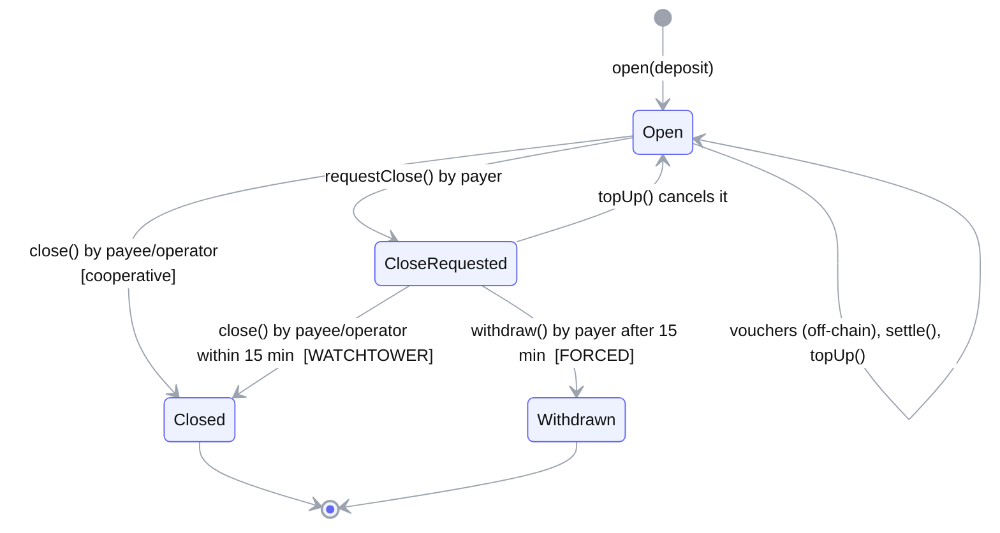
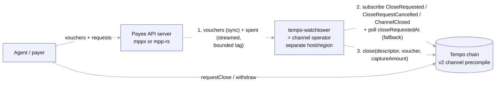

# tempo-watchtower: The Complete Study Guide

**Who this is for:** you, the founder, if you haven't used Tempo and aren't deep in crypto yet.
**Goal:** by the end you can explain the chain, the payment flow, the exact problem, what we're
building and why, and survive a 15-minute judge interview designed to find gaps in your
understanding.

**How to study it:**
1. Read Parts 1–4 once, slowly. They build the mental model.
2. Do the hands-on exercises in Part 11. Reading gives you vocabulary; doing gives you
   confidence.
3. Drill Part 9 (the judge Q&A) out loud until you can answer without looking.

Every fact here was checked against a primary source: the Tempo session spec, Tempo's contract
source, the mppx and mpp-rs SDK source, or live chain data. Sources are in Part 12. Where
something is **not yet known**, the guide says so. Knowing where your knowledge ends is part of
not getting caught out.

---

## Part 0: The 60-second version (memorize this)

> AI agents and apps can now pay APIs *as they use them* on Tempo, a payments blockchain from
> Stripe and Paradigm. They do this through **payment channels**. The agent locks money in an
> on-chain escrow, then sends tiny signed IOUs called **vouchers** as it consumes service. The
> server collects the money on-chain later.
>
> The catch: the agent can call **`requestClose`** at any time. That starts a **15-minute clock**.
> If the server hasn't claimed what it earned by then, the agent calls **`withdraw`** and gets
> back **everything the server hadn't yet claimed**, including money for service it already
> used.
>
> Neither official SDK watches for this. Automatic claiming is off by default, and it only runs
> while requests are flowing. On Tempo mainnet since June, **304 of 344** resolved close requests
> got **no response** from the payee. The 40 payees who did respond took a median of **83
> seconds**.
>
> **tempo-watchtower** is an always-on Rust service that acts as the channel's **operator**, a
> role Tempo's v2 channels support natively. It watches for close requests and, within seconds,
> closes the channel and claims exactly what the server earned. The operator can't redirect
> funds, so it never needs the server's main key.

If you can say that in your own words and answer "why?" at every sentence, you're 70% ready.

---

## Part 1: Blockchain basics (only what you need)

### 1.1 Accounts, keys and signatures
- A blockchain **account** is identified by an **address** (e.g. `0x742d…fe00`). Whoever holds
  the matching **private key** controls it.
- A **signature** proves "the owner of this key approved exactly this message." Anyone can
  verify it with the public address, and nobody can forge it without the private key.
- Tempo uses the same key and signature scheme as Ethereum: **secp256k1 ECDSA** signatures.
- **EIP-712** is a standard for signing *structured data* (named fields like `channelId`,
  `cumulativeAmount`) instead of an opaque blob. Tempo vouchers use it.
  - *Analogy:* signing a filled-in form rather than a blank sheet of paper.

### 1.2 Transactions, blocks and fees
- To change anything on-chain (move money, call a contract), you send a **transaction**, signed
  by your key.
- Validators bundle transactions into **blocks**.
- Each transaction costs a **fee**. Fee = **gas used** (how much computation) × **gas price**
  (price per unit).
- **Finality** means the point after which a transaction can't be undone. Tempo's spec says
  finality is about **500 ms** (§14.12). That's very fast; Ethereum takes minutes.

### 1.3 Smart contracts, precompiles, events
- A **smart contract** is a program deployed on-chain. Its functions can hold money and enforce
  rules nobody can bypass: not you, not the server, not the payer.
- A **precompile** is a contract built directly into the chain's node software at a fixed
  address, rather than deployed by a user. It's faster and cheaper, and it's part of the
  protocol itself.
  - Tempo's v2 payment-channel escrow is a precompile at
    `0x4d50500000000000000000000000000000000000`.
- When a contract does something notable, it emits an **event** (also called a **log**), e.g.
  `CloseRequested(channelId, payer, payee, closeGraceEnd)`.
  - Off-chain programs can **subscribe** to events or **query** past ones.
  - That's how our watchtower "sees" close requests, and how we counted the unanswered close requests.

### 1.4 RPC
- Programs talk to the chain through an **RPC endpoint**: a URL you send JSON requests to.
- Typical requests: "call this function", "send this transaction", "give me these events".
- Tempo mainnet RPC is `https://rpc.tempo.xyz` (chain ID 4217).
- Tempo testnet ("Moderato") is `https://rpc.moderato.tempo.xyz` (chain ID 42431).

### 1.5 Stablecoins
- A **stablecoin** is a token worth about $1 (e.g. USDC).
- On Tempo, stablecoins follow Tempo's token standard, **TIP-20**, and use **6 decimals**. So an
  on-chain amount of `1000000` means $1.00.

### 1.6 Payment channels (the key idea)
Paying on-chain for every tiny API call would cost a fee each time and add delay. A **payment
channel** fixes this:
1. **Open:** the payer locks a deposit in an escrow contract (1 on-chain transaction).
2. **Pay off-chain:** the payer sends the server signed IOUs (vouchers) as it uses the service.
   These are free and instant; they never touch the chain.
3. **Settle / close:** the server submits the latest voucher on-chain to collect the money
   (1 transaction). Whatever wasn't spent goes back to the payer.

Thousands of payments cost only 2–3 on-chain transactions. Bitcoin's **Lightning Network** made
this idea famous.

*Analogy:* a **bar tab**.
- You hand the bartender your card (the deposit).
- Each drink, you sign the running total on the tab (a voucher).
- At the end, they charge the card for the final total (settle/close).

---

## Part 2: Tempo, the chain

### 2.1 What Tempo is
- A blockchain from **Stripe and Paradigm**, built specifically for **payments**.
- **Mainnet since March 18, 2026.**
- **EVM-compatible:** Ethereum tools, contracts and addresses work. It's built on **Reth**, a
  Rust Ethereum node.
- **Fees are paid in dollars (stablecoins), not a volatile gas token.**
  - Gas prices are denominated in **attodollars**, 10⁻¹⁸ USD. That's from Tempo's own source
    code.
  - The fee token must be a USD-denominated TIP-20 stablecoin.
- **Fee sponsorship:** a transaction can carry a second signature from a *fee payer*, so someone
  else pays the fee (spec §8.1). A server can pay the fees for its customers' channel opens.
- **Fast finality:** about 500 ms.

### 2.2 Why that matters for us
- Settling is cheap. A `settle()` uses ~301,831 gas. At today's **mainnet** gas price of
  600 million attodollars per gas (the protocol's price floor), that's about **$0.00018**, a
  fiftieth of a cent. A `close()` is ~80,913 gas, about **$0.00005**. At the price ceiling (12
  billion) they cost 20× more: $0.0036 and $0.001.
  - Careful: testnet's gas price is different (~5.9 billion). Always quote mainnet numbers.
  - That cheapness is exactly why a judge will ask "why not just settle constantly?"
    (Part 9 answers this.)
- Fast finality means once the watchtower's `close()` lands, it's final in about half a second.

---

## Part 3: MPP (Machine Payments Protocol)

### 3.1 The idea
- **MPP** is an open standard **co-authored by Stripe and Tempo Labs**, launched March 2026.
  It lets any client (an AI agent, an app, a human) **pay for an API inside the HTTP request
  itself**. No API keys, no accounts, no checkout.
- It uses the long-reserved HTTP status code **402 Payment Required**:
  1. The client calls an API.
  2. The server replies **402** with a **challenge**: here's the price, and how to pay.
  3. The client retries with an `Authorization: Payment …` header carrying a **credential**
     (proof of payment).
  4. The server verifies it and returns the content plus a **receipt**.

### 3.2 Two "intents"
- **charge:** pay the full amount up front, once. Simple.
- **session:** open a payment channel and **pay incrementally as you consume**, e.g. per LLM
  token. The spec's headline use case is **LLM token streaming** (spec §1.1). **This is our
  world.**

### 3.3 The SDKs you'll hear about
- **`mppx`** (TypeScript, `wevm/mppx`): client and server SDK. It's the main one servers use.
- **`mpp-rs`** (Rust, `tempoxyz/mpp-rs`): Tempo Labs' official Rust SDK.

---

## Part 4: Tempo sessions, the full mechanics

### 4.1 The actors
- **Payer:** the client or agent. It deposits funds and signs vouchers.
- **Payee:** the server or API. It receives the money.
- **Operator (v2 only):** an optional address the payee designates to perform channel
  operations for it. **This is where tempo-watchtower lives.**
- **Escrow:** the on-chain contract or precompile that holds the deposit and enforces the rules.

### 4.2 The session flow (spec §1.2)

```text
 Client (payer / agent)          Server (payee / API)          Tempo chain (escrow)
        |                                 |                              |
        |  1. GET /api/resource           |                              |
        |-------------------------------->|                              |
        |                                 |                              |
        |  2. 402 Payment Required        |                              |
        |     (session challenge)         |                              |
        |<--------------------------------|                              |
        |                                 |                              |
        |  3. retry, action="open"        |                              |
        |     (signed open tx)            |                              |
        |-------------------------------->|                              |
        |                                 |  4. broadcast open(...)      |
        |                                 |     deposit locked           |
        |                                 |----------------------------->|
        |  5. 200 OK + streaming          |                              |
        |     response + receipt          |                              |
        |<--------------------------------|                              |
        |                                 |                              |
        |  +-- repeat while consuming ------------------------------+    |
        |  | 6. action="voucher"          |                         |    |
        |  |    (signed cumulativeAmount) |                         |    |
        |  |----------------------------->|   (off-chain: free,     |    |
        |  | 7. 200 OK + more content     |    no transaction)      |    |
        |  |<-----------------------------|                         |    |
        |  +--------------------------------------------------------+    |
        |                                 |                              |
        |  8. action="close"              |                              |
        |     (cooperative close)         |                              |
        |-------------------------------->|                              |
        |                                 |  9. close(voucher,           |
        |                                 |     captureAmount)           |
        |                                 |----------------------------->|
        | 10. 200 OK + receipt (txHash)   |                              |
        |<--------------------------------|                              |
```

The **happy path** ends with a **cooperative close**: the client asks the server to close, and
the server submits `close()`.

### 4.3 Vouchers are cumulative (spec §10.5)
A voucher says "I authorize **N total** so far", not "add N more":
- Voucher #1: `cumulativeAmount = 100`
- Voucher #2: `cumulativeAmount = 250`
- Voucher #3: `cumulativeAmount = 400`

Only the **highest** voucher matters. When settling, the contract pays
`delta = cumulativeAmount − alreadySettled`.
- *Why this design:* a lost or duplicated voucher doesn't matter. Each new one supersedes the
  last.

A voucher is an EIP-712 signature over `(channelId, cumulativeAmount)`. It is bound to the
chain ID and the escrow address, so it can't be replayed elsewhere (spec §10, §14.1).

### 4.4 The server's bookkeeping (spec §12.1)
Per channel, the server tracks:

| Field | Meaning |
|---|---|
| `deposit` | how much the payer locked |
| `acceptedCumulative` | the highest voucher amount accepted (what the payer has *authorized*) |
| `spent` | how much service has *actually been delivered and charged* |
| `settledOnChain` | how much has already been claimed on-chain |
| `closeRequestedAt` | when a close was requested (0 = none) |

Key relationships:
- `available = acceptedCumulative − spent` is prepaid-but-unused credit.
- **Unsettled earnings = `spent − settledOnChain`.** This is the money at risk.
- The spec requires servers to **persist `spent` before delivering service** (§12.3, "Crash
  Safety").

**Important rule (§13.2):** a server must **never capture more than was actually consumed.**
The payer may have pre-authorized more (a voucher for $3.20 when only $3.00 of service was
used). For v2 the close amount is:

> `captureAmount = max(spent, settledOnChain)`

This is why our watchtower must know `spent`, not just the latest voucher.

### 4.5 The escrow functions and who may call them
From the v2 reference contract `TIP20ChannelReserve.sol` (checked in the source):

| Function | Who can call | What it does |
|---|---|---|
| `open` | anyone (becomes the payer) | creates the channel, locks the deposit |
| `topUp` | payer | adds deposit; **cancels a pending close request** |
| `settle` | **payee or operator** | claims `voucher − settled` to the payee; the channel stays open |
| `close` | **payee or operator** | pays the payee `captureAmount − settled`, refunds the payer `deposit − captureAmount`, ends the channel |
| `requestClose` | payer | starts the grace clock |
| `withdraw` | payer | after the grace period: refunds `deposit − settled` to the payer, ends the channel |

Critical details:
- **Payouts only ever go to `descriptor.payee` and `descriptor.payer`.** An operator can trigger
  a close but can never send money anywhere else.
- `CLOSE_GRACE_PERIOD = 15 minutes`. On-chain, both testnet and mainnet return **900 seconds**.
- **`settle` vs `close`:** `settle` claims money and keeps the channel open. `close` claims money
  and ends the channel. After a `requestClose` the payer wants out anyway, so the watchtower uses
  `close`.

### 4.6 v1 vs v2 channels (spec §4)
- **v1:** the older, legacy `TempoStreamChannel` contract. Only the payee can settle or close;
  there is no operator.
- **v2:** the **TIP-20 channel precompile**. The spec says "New servers SHOULD" use v2.
  - v2 adds the **`operator`** field: "payee-side operator authorized for channel operations".
  - The server advertises it in its 402 challenge (`methodDetails.operator`).
  - It's baked into the channel's ID, so it's fixed for the channel's whole life.
  - It's live on mainnet since June 2026.

### 4.7 The two ways a channel ends



**Forced close (spec §13.3):**
1. The payer calls `requestClose`.
2. A 15-minute grace period starts.
3. The server can still `settle`/`close` during it.
4. After it ends, the payer calls `withdraw`.
5. The payer gets all remaining unsettled funds.

Why forced close exists: it's **payer protection**. If a server disappears, the payer's deposit
isn't stuck forever (§14.13). **This is a legitimate, necessary feature. Don't call it a bug in
the interview.** The problem is what happens to the *payee* when the payee is the one who
isn't watching.

---

## Part 5: The problem, precisely

### 5.1 Worked example (learn this one cold)
Numbers are illustrative.

- An agent opens a channel with a **$5.00** deposit.
- It streams LLM output. The server has **delivered and charged $3.00** of service (`spent`).
- The agent's latest voucher authorizes **$3.20** (it pre-authorized a little extra).
- Earlier, the server claimed **$1.00** on-chain (`settledOnChain`).
- So **unsettled earnings = $3.00 − $1.00 = $2.00.**

The agent calls `requestClose`. Then one of two things happens.

**A. Nobody is watching** (the server is down, deploying, or simply has no watcher):
- 15 minutes pass, and the agent calls `withdraw`.
- The contract refunds `deposit − settled` = $5.00 − $1.00 = **$4.00** to the agent.
- The server **loses $2.00 of service it already delivered.**

**B. tempo-watchtower is the operator:**
- Within seconds it calls `close(captureAmount = max($3.00, $1.00) = $3.00)`.
- The server gets **$2.00** more (total $3.00, exactly what was used).
- The agent is refunded $5.00 − $3.00 = **$2.00**, its unused prepaid credit.
- **Fair to both sides.** The watchtower takes nothing extra; it just makes sure the rules
  settle correctly.

### 5.2 Why it keeps happening (verified in SDK source code)
- **Neither `mppx` nor `mpp-rs` subscribes to `CloseRequested` events.**
  - Their server code only reads `closeRequestedAt` to **refuse** new vouchers.
  - Nothing reacts by closing the channel.
- **mppx's automatic settlement is opt-in.** The `SettlementSchedule` setting is optional. If it
  isn't configured, nothing settles automatically.
- **When mppx auto-settle is configured, it only runs inside request handling.** A settlement is
  checked when a paid request comes in. So if the server crashes, is redeploying, or just stops
  receiving requests, it stops settling. Those are exactly the moments a close request hurts.
- **mpp-rs has no automatic settlement at all.** It only has a helper to build the settle call.
- **Fair point a judge will raise:** if a payee *does* configure mppx's amount threshold ("settle
  every $0.10 earned"), exposure per channel is capped at about that threshold. That's a real
  mitigation. Our answer:
  - It's off by default, and most payees evidently haven't set it (see 5.3).
  - It still leaves the tail since the last settle.
  - The smaller you make the threshold, the more transactions you send.
  - The watchtower lets you settle rarely *and* lose nothing.
- **Adversarial angle:** a payer who knows this can time `requestClose` for when the server is
  down or quiet, then walk away with the unsettled balance. It's legal under the protocol. It's
  effectively free service.

### 5.3 What the on-chain data shows (and what it does NOT show)
We scanned **every** v2 channel event on Tempo mainnet: 493,160 events from **June 10 to
September 26, 2026**.

The first analysis had a bug. It only counted a payee `close()` as "responding", and it used the
testnet gas price. A judge caught both. These are the **corrected** numbers
(`onchain/agg2.py`, `onchain/delay.py`):

| Fact | Number |
|---|---|
| Channels opened | 268,596 (99.3% to one single payee) |
| Distinct payees / payers | 70 / 1,718 |
| Lifetime deposits / settled to payees | ~$4,234 / ~$352 |
| Close requests | 408 (344 resolved, 64 still open) |
| Resolved requests with **no payee-side response** before the payer's `withdraw` | **304** (from 14 payees; 202 of them are the dominant payee) |
| Resolved requests where the payee **did** respond | 40 (39 by `settle`, 1 by `close`) |
| How fast responders reacted | median **83 s**, fastest 1 s |
| Unanswered **and** provably used (the channel had a settle before the request) | 29 withdrawals, 5 payees, **≤ $36** refunded |
| Refund size per unanswered withdraw | median **$0.50**, max $25, total $1,966 |
| Channels with an operator set | 676. 302 of them are "self-assigned" (operator = payee), and 374 are truly delegated to 37 distinct operators |

Note: **a `settle` also counts as a response.** Claiming what you earned and then letting the
payer withdraw the rest is a perfectly good answer to `requestClose`. The contract only lets the
payee or operator call `settle`, so every `Settled` event proves the payee side acted.

**Be precise about what this proves, because judges will push:**
- ✅ **It proves** that most payees don't react to close requests: 304 of 344. It also proves
  that payees who *do* watch react fast, in a median of 83 s. Watching works; most people just
  don't do it.
- ❌ **It does not prove** big losses.
  - Refunds include deposit the payer never used, which is legitimately theirs.
  - On-chain data can't see `spent`; that lives on the server.
  - The provable-usage subset (≤ $36 across 5 payees) is an **upper bound**, not a measured
    loss.
  - **Today's dollar losses are tiny. Say so first, before a judge does.**
- ❌ **It does not prove** the market is growing. Excluding the dominant payee, new channels
  **peaked in July and have fallen**. The honest description is "early and lumpy."
- 🟡 **The likely story behind many of these:** test or demo servers that shut down, so the payer
  correctly got its money back. That's the protocol working for payers. It's still the same
  gap: had those servers delivered service, the money would have gone back too.
- 🟢 **The validation: builders are hand-rolling this.**
  - Of the **16 payees** that received close requests, **6 now answer them**, each with code they
    wrote themselves. **10 answer none.**
  - The busiest payee (99% of channels) answered **0 of 194** until **Aug 22**, then started
    answering. Since then it has answered 11 of 19, and the 8 it skipped had ~$0 to claim. **Its
    responder works; never say it "misses."**
- 🔴 **Know this before a judge does. Much of the activity is builders testing each other.**
  - All 44 of the busiest payee's "$25 refunded, $0 claimed" channels came from **one payer
    wallet that is itself a payee**.
  - Two such wallets drive **99%** of the busiest payee's forced refunds.
  - Among payees that answer none, provable exposure is tiny (≤ ~$6 each).
  - So never present these refunds as lost revenue. **The behavior is the signal, not the
    dollars.**

The one-sentence version for judges: *"The chain shows most payees don't answer close requests,
and the ones who do each hand-rolled their own responder. The dollars are small, and much of the
activity is builders testing. We give every payee one shared, open, reliable watcher before real
volume arrives."*

### 5.4 Why this matters beyond today's small numbers
- Exposure = **what's been served but not yet settled**, not the deposit size. So a payee who
  isn't watching has two choices: **settle constantly** (more transactions, more tuning,
  more fees at scale), or **limit how much credit it extends** between settles (worse service
  for agents).
- A watchtower removes that trade-off: **settle rarely, and still never lose**.
- That's the ecosystem-impact argument: a precondition for MPP sessions to scale.

---

## Part 6: What we're building

### 6.1 One sentence
An always-on Rust daemon that is **the operator of the payee's v2 channels**. It keeps a mirror
of what each client has actually consumed, detects `CloseRequested` within seconds, and calls
`close()` with the correct capture amount long before the 15-minute deadline.

### 6.2 Architecture



**Components:**
1. **Payee integration (tiny middleware):**
   - The payee advertises the watchtower's address as `methodDetails.operator` in its 402
     challenges. Every new v2 channel is then bound to our operator.
   - The middleware **forwards each accepted voucher synchronously** and **streams `spent`
     updates** to the watchtower with a small, bounded lag.
2. **Ledger:** a crash-safe local store, keyed by `channelId`. It holds the channel descriptor,
   the highest voucher (amount and signature), `spent`, `settledOnChain` and `closeRequestedAt`.
3. **Chain watcher:**
   - A WebSocket subscription to the precompile's events.
   - A **fallback poll** of channel state (`getChannelStatesBatch`) in case the subscription
     silently drops.
4. **Closer:**
   - On a close request, compute `captureAmount = max(spent, settledOnChain)`.
   - Pick the voucher to submit; its cumulative amount must be ≥ `captureAmount`.
   - Sign and send `close()` with the **operator key**, then confirm.
   - Retry with backoff, and escalate or alert if the deadline approaches.
5. **Ops surface:**
   - Metrics and alerts: channels watched, time-to-close, operator fee balance.
   - A CLI.

### 6.3 The per-channel state machine the daemon runs
```
WATCHING ──CloseRequested──▶ CLOSING ──tx confirmed──▶ DONE
   ▲                            │
   └──CloseRequestCancelled─────┘ (payer topped up; keep watching)
CLOSING ──deadline near & still failing──▶ ALERT (page a human; keep retrying)
```

### 6.4 Design decisions you must be able to defend
- **Why be the operator instead of holding the payee's key?**
  - The operator can only trigger settle/close, and payouts can only go to payee or payer.
  - The payee's main key stays cold, which makes a third-party, hosted watchtower possible.
  - **Know the honest limit:** the operator *chooses the capture amount*, anywhere between what's
    already settled and the voucher amount. So the operator is trusted by *both* sides on the
    amount:
    - a compromised operator could under-capture, handing the payee's earnings back to the
      payer;
    - or it could over-capture above `spent`, taking the payer's unused credit.
    - It can never send money to a third party.
  - **Mitigations:**
    - a separate operator key **per payee** (never one shared key for all customers);
    - capture computed only from the payee's forwarded `spent`;
    - careful key custody;
    - an alert to the payee on every close.
  - **Adoption limit:** the operator is baked into the channel ID when the channel opens. So
    only *new* channels are protected, switching operator means new channels, and each channel
    has exactly one operator slot.
- **Why run on separate infrastructure?** The failure we protect against is "the server is
  down". A watcher inside the server dies with it.
- **Why `close` and not `settle`?** After `requestClose` the payer is leaving anyway. `close`
  claims the earnings and ends the channel in one transaction, cheaper and final. It also removes
  any chance the payer's `withdraw` races us.
- **Why `max(spent, settledOnChain)` and not the highest voucher?** The spec forbids capturing
  more than consumed (§13.2). Over-capturing would take the payer's prepaid-but-unused money,
  which is wrong and would be flagged immediately.
- **Consistency model ("what if the server crashes after serving but before telling the
  watchtower?"):**
  - Vouchers are forwarded **synchronously**; they're relatively rare.
  - Consumption (`spent`) is **streamed with a small, bounded lag**. Forwarding every metered
    token synchronously across regions would add latency to every response chunk.
  - So the honest guarantee is: **at most a few seconds of service can be lost.** Say the exact
    lag you configure.
  - This mirrors the spec's own crash-safety rule of persisting `spent` before delivery (§12.3).
  - Never "fix" lag by capturing the full voucher amount. That would break §13.2 (capturing more
    than was consumed).
- **Missed events:** WebSocket subscriptions drop silently, so there's a periodic poll of
  `closeRequestedAt` as a backstop. With a 15-minute window, polling every ~10–30 s is plenty.
- **Deadline handling:**
  - Read the deadline from the chain (`closeGraceEnd` in the event, or `CLOSE_GRACE_PERIOD`).
    Never hard-code 15 minutes; the spec allows other values.
  - **Subtle point:** `close()` doesn't check the grace period at all. So the *real* deadline is
    the moment the payer's `withdraw` is mined, which can be much later: on mainnet one channel
    was settled ~8 days after its close request.
  - The tower aims for seconds, but it keeps trying until the channel is actually closed.
- **Separate key = no nonce conflicts.** The operator has its own account, so its transactions
  never collide with the payee's own.
- **Fees:** `close()` costs ~$0.00005 at mainnet's floor gas price. The operator account needs a small USD-stablecoin balance,
  and we alert if it runs low.
- **Why Rust:**
  - A single static always-on binary.
  - No garbage-collection pauses near a deadline.
  - Strong types for the money state machine.
  - The same language as Tempo's node (Reth) and `mpp-rs`.
  - Keep this for the tech demo; Colosseum says it doesn't judge on language choice.

### 6.5 Scope: hackathon MVP vs. later
**MVP (by Oct 12):**
- The daemon: ledger, watcher with poll fallback, closer.
- A minimal integration that forwards vouchers and `spent` from a demo server.
- A testnet demo: two runs, with and without the watchtower.
- An open-source repo.

**Later:**
- One-line mppx/mpp-rs middleware.
- A hosted multi-tenant, multi-region operator service.
- An alerting dashboard.
- Housekeeping: closing long-idle channels (the spec suggests closing after 30+ days inactive,
  §14.2).

**Not supported:**
- v1 channels (they have no operator slot, so we'd need the payee's key).
- Existing v2 channels opened *without* our operator. The operator is fixed at open time; new
  channels only.

### 6.6 Things NOT yet known: be honest if asked
- Whether a standard Ethereum-style transaction works for the operator's `close()`, or it needs
  Tempo's own transaction type. `mpp-rs`/`mppx` already handle Tempo transactions, so reuse
  their encoding. Verify in week 1.
- Real `spent` data per channel: only servers have it, so we can't measure true losses from
  outside.
- Who the 70 payees are (company names). The addresses are known; mapping them is an outreach
  task.
- Whether Tempo plans its own watcher. There's no public roadmap or announcement either way.

---

## Part 7: Business and market, in plain words
- **Open source core:** anyone can self-host for free. This builds trust and earns the
  open-source judging credit.
- **Paid:** a **hosted, independent operator**, priced **per payee per month**. A test price like
  $29/month is still to be validated.
  - The pitch to a customer: "a few dollars a month instead of risking your unsettled revenue
    every time you deploy."
- **Why per payee, not per channel:** channels are many and tiny (the average deposit today is
  pennies). Payees are the paying customers.
- **Honest market size:**
  - 70 payees and 1,718 payers on mainnet, with small deposits.
  - Today's revenue ceiling is tiny: 70 × $29 ≈ $2k/month even at 100% capture.
  - **The business is a bet that MPP sessions grow.** Stripe and Tempo are pushing MPP, and
    forced-close risk is one of the things holding session sizes down.
- **First customers:** the 10 payees answering no close requests, then the 6 maintaining their
  own responders, then new mppx/mpp-rs session servers.
- **Colosseum is fine with "small but growing"**, since their own criteria say it verbatim. What
  they punish is inflated claims.

---

## Part 8: Competitors and alternatives: how to answer

| Thing | What it is | Why it's not this |
|---|---|---|
| Settle often (mppx amount threshold, or a cron) | the payee settles every $X or every N seconds | cheap: ~$0.00018 per settle at mainnet's floor gas price, ~$0.26/day per channel at once a minute. But it's off by default, still leaves the tail since the last settle, and more settles means more transactions and tuning. If it runs inside the server, it dies with the server |
| DIY watcher script with an operator key | the payee writes its own mini-watchtower | totally possible, and it's the real competitor. They then own a 24/7 on-call with a 15-minute deadline: WebSocket drops, fee balance, key custody, retries, reorg checks. Our pitch is "we run that for you, open source, done right" |
| An in-SDK watcher | if mppx or mpp-rs added one | runs inside the server, so it dies in the exact outage we protect against. None exists today |
| `temprano-watchtower` | a Rust service that durably re-broadcasts *pre-signed* Tempo transactions | not channel-aware: it doesn't watch `CloseRequested`, doesn't know `spent`, and can't compute the capture amount. The name is a coincidence |
| Lightning / CKB Fiber watchtowers | mature watchtowers on other networks | built to punish **fraud** (old revoked states) in two-way channels, on other chains. Tempo's one-way cumulative vouchers have no revoked states; our risk is **liveness**. Fiber's "MPP" means *multi-path payments*, a different thing |
| MPP-Inspector | "Postman for HTTP 402", a dev/debug tool | tests a session manually; doesn't guard it |
| Generic monitoring (alerts) | pages a human | a human at 3am can't reliably act inside 15 minutes, and alerting ≠ closing |

---

## Part 9: Judge interview drill (practice out loud)

### Basics (they check you understand your own product)
1. **What is Tempo?**
   - A payments blockchain from Stripe and Paradigm, EVM-compatible and built on Reth.
   - Fees are paid in dollar stablecoins and finality takes ~500 ms.
   - Mainnet since March 2026.
2. **What is MPP?** An HTTP-native payment standard from Stripe and Tempo Labs. The server
   replies 402 with a challenge, and the client pays inside the request.
3. **What's a session?** MPP's pay-as-you-consume mode: a payment channel where the client
   deposits once, streams signed cumulative vouchers, and the server settles on-chain later.
4. **What's a voucher?** An EIP-712 signature by the payer over `(channelId, cumulativeAmount)`
   authorizing a running total, bound to the chain and the escrow.
5. **Why cumulative, not incremental?** Only the highest one matters. Lost or duplicate vouchers
   are harmless, and there's no replay risk.
6. **Who can call `requestClose` / `withdraw` / `close` / `settle`?**
   - The payer calls `requestClose` and `withdraw`.
   - The payee or operator calls `close` and `settle`.

### The problem
7. **Isn't forced close a feature?**
   - Yes. It protects payers from servers that vanish, and we don't change it.
   - The gap is on the payee side. The payee is supposed to react within 15 minutes, but no SDK
     makes that happen reliably. The data shows payees almost never do.
8. **Weren't most of those unanswered close requests just dead test servers?**
   - Probably many, yes, and the payer correctly got their money back.
   - The point isn't the dollars. It's the behavior: 304 of 344 unanswered, from 14 payees.
   - The 40 who did respond took a median of 83 seconds, so watching works when someone does it.
   - Provably-used-and-unanswered channels total at most $36. We say that openly.
9. **So how much money is actually at risk?**
   - Today, very little: ≤ $36 provably, and ~$4.2k in lifetime deposits.
   - We're honest that the market is early and lumpy. The risk scales with session size, and
     this risk is one reason sessions stay small.
10. **Why doesn't the server just settle often?**
    - It can, and it's cheap: ~$0.00018 a settle at mainnet's floor gas price.
    - **Don't argue fees.** Argue these instead:
      - It's off by default, and most payees haven't turned it on.
      - It still leaves the tail since the last settle.
      - mppx's version only runs while requests flow.
      - A watcher you write yourself means owning a 15-minute on-call forever.
    - The watchtower lets you settle rarely and still lose nothing.
11. **Why can't the server just run a watcher itself?** It can, if it runs it on *separate*
    infrastructure and keeps it healthy 24/7. That's our product, open source, and hosted if
    they don't want to operate it.

### Technical deep-dive (where they try to catch you)
12. **Why is being the "operator" safe? What can a rogue operator do?**
    - Payouts only ever go to payee or payer; it can't send money to a third party.
    - **But** it picks the capture amount. A compromised operator could under-capture (hurting
      the payee) or over-capture above `spent` (hurting the payer), and it can close early.
    - Mitigations:
      - a per-payee key (never shared);
      - capture computed from the payee's forwarded `spent`;
      - careful key custody;
      - an alert on every close.
    - Say this unprompted; it shows you really understand it.
13. **How much do you claim when you close?**
    - `max(spent, settledOnChain)`, per spec §13.2. Never the highest voucher blindly, because
      that could take the payer's unused prepaid credit.
14. **How do you know `spent`? It's off-chain.** The payee's server forwards it to us. It must
    forward *before* serving, the same crash-safety principle as spec §12.3.
15. **What if the server crashes after serving but before forwarding?**
    - Vouchers are forwarded synchronously. Consumption streams with a bounded lag of a few
      seconds.
    - So at most those few seconds of service are at risk.
    - We state the number rather than claim zero.
16. **What if your WebSocket drops and you miss the event?** We also poll `closeRequestedAt` on
    a schedule, every ~10–30 s. The window is 15 minutes, so there's lots of margin.
17. **What if the payer calls `topUp` during the grace period?** That cancels the close request
    (`CloseRequestCancelled`), and we go back to watching.
18. **What about chain reorgs?** Finality is ~500 ms, so it's a minor risk. We confirm our close
    landed and re-check channel state; if something's off, we retry within the window.
19. **Does it work for existing channels?** Only v2 channels opened with our address as
    operator, because the operator is fixed when the channel opens. v1 channels have no operator
    slot.
20. **Is the grace period always 15 minutes? What's the real deadline?**
    - Today, yes: 900 s on mainnet and testnet, verified on-chain. The spec allows other values,
      so we read it from the chain.
    - The real deadline is when the payer's `withdraw` lands. `close()` stays valid until then,
      so the tower keeps retrying past the grace period.
21. **Who pays the transaction fee for `close`?** The operator account, about $0.00005 per
    close at mainnet's floor gas price. The spec says server-initiated operations are paid by
    the server side (§8.3).
22. **Why Rust?**
    - A single static always-on binary with no GC pauses near a deadline.
    - A typed money state machine.
    - The same stack as Tempo's node and mpp-rs.
    - (Keep it short; it's not the selling point.)

### Business and strategy
23. **Why won't Tempo just build this?**
    - They could. There's no public sign they are, and today neither SDK watches.
    - An in-SDK watcher would die with the server. Running an always-on operator service for
      other people's channels is an operations business, not protocol work.
24. **How do you make money?** An open-source core, plus a hosted independent operator at a
    per-payee monthly price we're validating with the first payees.
25. **Who's your first customer?**
    - The **10 payees that answer no close requests**.
    - Then the 6 maintaining their own responders; offer to replace their private copy.
    - Then every new mppx/mpp-rs session server.
26b. **"Payees already build their own. Why use yours?"**
    - Six of 16 each rewrote the same thing, which shows the need. Ten still have nothing.
    - A shared, open, independent tool replaces the copies and covers the rest.
    - Sell reliability and not having to build it, not raw speed.
26c. **"Isn't most of this activity just builders testing?"**
    - Largely, yes. Two payer wallets that are themselves payees drive 99% of the busiest payee's
      forced refunds.
    - Say it first. The dollars are small; the behavior is the signal.
26. **Why you, solo?** *(Prepare your own two specific, true proof points.)*
27. **What did you build during the hackathon?** *(Answer honestly with the actual repo state;
    disclose any pre-existing code.)*
28. **What's next after the hackathon?** A one-line mppx/mpp-rs middleware, then the hosted
    multi-region operator, alerts, and idle-channel housekeeping.

### Trap questions (don't bluff)
29. **"Lightning watchtowers already solved this."** Different threat model. Lightning towers
    punish fraud (revoked states) in bidirectional channels. Tempo's cumulative one-way
    vouchers have none. Our risk is liveness.
30. **"CKB Fiber has a Rust watchtower for MPP."** Fiber's "MPP" is multi-path payments on CKB,
    not Tempo's Machine Payments Protocol. There's no Tempo code in it.
31. **Anything you don't know:** say "I haven't verified that yet. Here's how I'd find out."
    Judges respect that far more than a confident guess.

---

## Part 10: Glossary
- **402 Payment Required:** the HTTP status MPP uses to ask for payment.
- **Attodollar:** 10⁻¹⁸ USD, the unit of Tempo gas prices.
- **Capture amount:** how much of the deposit the payee takes at close. For v2 it's
  `max(spent, settledOnChain)`.
- **Challenge / credential / receipt:** the server's payment request, the client's proof, and
  the server's confirmation.
- **Cooperative close:** the client asks, and the server closes on-chain.
- **Cumulative amount:** the running total a voucher authorizes.
- **EIP-712:** the standard for signing structured data.
- **Escrow:** a contract holding funds under rules.
- **Event / log:** a record a contract emits, which off-chain programs can read.
- **Finality:** when a transaction can no longer be reversed (~500 ms on Tempo).
- **Forced close:** the payer's `requestClose` → 15 min → `withdraw` path.
- **Gas:** a unit of computation. Fee = gas × gas price.
- **Grace period:** the 15 minutes after `requestClose` during which the payee/operator can
  still close.
- **Liveness:** being online and responsive in time (as opposed to *safety*: not doing wrong
  things).
- **mppx / mpp-rs:** the TypeScript / Rust MPP SDKs.
- **Operator:** a v2 channel role that can settle or close on the payee's behalf, fixed at
  channel open.
- **Payee / payer:** the server that receives payment / the client that pays.
- **Precompile:** a built-in contract at a fixed address, part of the chain itself.
- **RPC:** the JSON-over-HTTP interface for talking to the chain.
- **Session (intent):** MPP's pay-as-you-consume mode, using a payment channel.
- **Settle:** claim earned funds on-chain, keeping the channel open.
- **Spent:** service actually delivered and charged (off-chain, server-side).
- **TIP-20:** Tempo's token standard (stablecoins, 6 decimals).
- **v1 / v2 channel:** the legacy contract escrow / the newer precompile escrow with the operator
  slot.
- **Voucher:** the payer's signed cumulative IOU.
- **Watchtower:** a service that watches channels and acts on a party's behalf when needed.

---

## Part 11: Hands-on exercises (do these; they're your real confidence)
1. **Read the source of truth (about 45 min).** Open
   `https://paymentauth.org/draft-tempo-session-00.txt` and read §1.1–1.2, §6.2–6.5, §10.5,
   §12.1–12.3 and §13–14. Map each section to Parts 4–5 above.
2. **Read the contract (about 30 min).** Open `tempoxyz/tempo` →
   `tips/verify/src/TIP20ChannelReserve.sol`. Find `settle`, `close`, `requestClose` and
   `withdraw`. For each, find the line that checks who the caller is, and the lines that move
   money.
3. **Query the chain yourself (about 10 min).** Run
   ```bash
   curl -s -X POST -H 'content-type: application/json' \
     --data '{"jsonrpc":"2.0","id":1,"method":"eth_call","params":[{"to":"0x4d50500000000000000000000000000000000000","data":"0x956c8327"},"latest"]}' \
     https://rpc.tempo.xyz
   ```
   The result `0x…384` = 900 seconds, the grace period, read live from mainnet. That's
   `CLOSE_GRACE_PERIOD()`.
4. **Re-run the data (about 5 min, once logs are downloaded).** Run the scripts in
   `research/phase4-pitch/onchain/` (run `agg2.py` and `delay.py`) and check you get the same 304 / 344 and 83 s numbers.
5. **Run a real session on testnet (half a day, and the most important one).** Use `mppx` or
   `mpp-rs` examples to spin up a session server and client on Moderato testnet.
   1. Open a channel and send a few vouchers.
   2. Kill the server and call `requestClose` from the client.
   3. Watch the 15 minutes pass, then `withdraw`.
   You'll have *felt* the problem, and that's your demo's left side.
6. **Explain it to a non-crypto friend** using the bar-tab analogy and the worked example (5.1).
   If they get it, you can explain it to a judge.

---

## Part 12: Sources (all checked 2026-09-27)
- Tempo session spec: `paymentauth.org/draft-tempo-session-00.txt`. Header dated 26 Sep 2026;
  see §1, 4, 6, 8, 10, 12, 13 and 14.
- v2 escrow contract: `github.com/tempoxyz/tempo/blob/main/tips/verify/src/TIP20ChannelReserve.sol`
  and `interfaces/ITIP20ChannelReserve.sol`.
- Gas figures: `tempoxyz/tempo` →
  `crates/node/tests/it/gas/snapshots/…tip20_channel_reserve_gas_snapshot_t7.snap`.
- Gas units (attodollars) and fee rules: `crates/primitives/src/transaction/mod.rs`,
  `crates/hardfork/src/constants.rs`.
- SDKs: `github.com/wevm/mppx` (`src/tempo/session/server/*`), `github.com/tempoxyz/mpp-rs`.
- Live chain calls: `rpc.tempo.xyz` (4217) and `rpc.moderato.tempo.xyz` (42431).
- On-chain analysis: `research/phase4-pitch/onchain/` plus `evidence-round2.md`.
- Competitor checks: `research/phase4-pitch/competitor-recheck-2026-09-27.md`.
- Tempo background (Stripe/Paradigm, mainnet date): `research/phase1-scouting/hackathon-intel.md`,
  §C.
